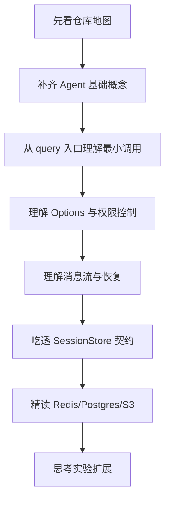

# 01 导学与阅读策略

## 本章抓手

这仓库最容易让初学者误判的地方是：文件不多、业务代码不重、目录看起来像一个“壳”。如果你只盯着“哪里是主程序”，会很快迷路。正确读法是把它当作一份公开 SDK 的教学切片。

## 先把误解拆掉

- 它不是一个完整产品应用，所以你看不到典型的 app/src/service/controller 分层。
- 它也不只是一个空壳，因为真正重要的内容在类型面、示例、契约和扩展点。
- 它更像实验室做二次开发时保留的一块“干净底板”。

## 你应该带着什么问题去读

- 一个 Agent 应用，最小启动入口是什么。
- 模型为什么能“调用工具”，工具权限又由谁控制。
- 会话历史为什么要持久化，持久化契约为什么要单独设计。
- 这个仓库为什么把三个存储实现放在 examples，而不是直接打进 SDK。

## 推荐的读法

### 第一遍：先抓轮廓

只读 [02-repo-map.md](02-repo-map.md)、[03-core-concepts.md](03-core-concepts.md)、[04-first-query.md](04-first-query.md)。目标是先形成一张大图，不要求记住全部字段。

### 第二遍：盯住一个抽象

建议盯 SessionStore。原因很简单：它是这里最完整、最可验证、最像软件工程教材的部分。对应文件是 ../examples/session-stores 和 ../examples/session-stores/shared/conformance.ts。

### 第三遍：开始做研究联想

回看权限控制、多 Agent、Hooks、MCP。问自己三个问题：

- 哪些地方可以加入策略学习或规则学习。
- 哪些地方可以做实验变量。
- 哪些地方最适合写成论文里的“system design”或“implementation”。

## 一张阅读地图

## 对研究生最重要的三个提醒

- 不要把“模型回答得很强”误当成“系统设计已经完成”。Agent 的真正难点经常在权限、状态、恢复、评测。
- 不要把类型定义看轻。这个仓库里，类型定义就是最核心的公开接口说明书。
- 不要急着扩展。先读懂约束，再设计扩展，代码会稳得多。

## 本章小结

这套教程的核心方法只有一句话：先用地图建立全局，再用契约抓住局部，最后再去谈扩展和研究。