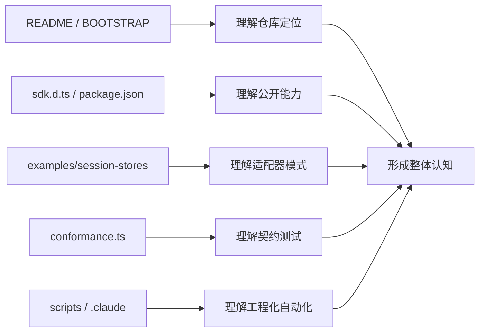

# 02 仓库地图与基线关系

## 本章抓手

你需要知道每个目录为什么存在。知道这一点后，后面的章节几乎都会顺下来。

## 仓库一句话结构

这个仓库 = 上游 Claude Agent SDK 的实验室快照 + 已发布 npm 包的可读镜像 + 三个会话存储参考实现。

## 目录职责

| 路径 | 角色 | 为什么重要 |
| --- | --- | --- |
| ../README.md | 根入口 | 说明仓库来自 Claude Agent SDK |
| ../INPLUSLAB_BOOTSTRAP.md | 基线说明 | 说明上游版本、快照时间、为什么同时保留 GitHub 与 npm 构件 |
| ../third_party/claude-agent-sdk-npm/package | 公开 API 与发布工件 | 这里有 sdk.d.ts、assistant.d.ts、sdk.mjs 等真正可学习的接口面 |
| ../examples/session-stores | 参考适配器 | 展示如何把 SessionStore 接到 Redis、Postgres、S3 |
| ../examples/session-stores/shared/conformance.ts | 契约测试 | 定义一个合格 SessionStore 至少必须满足什么行为 |
| ../scripts | 维护脚本 | 用于 GitHub issue/label 操作，不是核心 SDK 教学主角 |
| ../.claude/commands | 命令化提示词 | 展示仓库在工具链侧如何把 prompt 配成自动化任务 |
| ../CHANGELOG.md | 版本脉络 | 看新增能力何时进入 SDK，例如 sessionStore、promptSuggestions、hook events |

## 为什么没有自己的 src

因为当前策略是“先保留干净上游，再在其上分层扩展”。这在研究和实验室环境里是很合理的：

- 容易和 upstream 对比差异。
- 容易复现实验基线。
- 容易把实验层与官方行为边界切开。

这也正是 ../INPLUSLAB_BOOTSTRAP.md 反复强调的思路。

## 三层视角理解这个仓库

### 第 1 层：公开接口层

看 ../third_party/claude-agent-sdk-npm/package/sdk.d.ts。这里定义 query、Options、AgentDefinition、SessionStore、PermissionMode 等核心概念。

### 第 2 层：参考实现层

看 ../examples/session-stores。这里不是“SDK 核心内部实现”，而是“如何接入 SDK 的标准做法”。这对教学反而更友好，因为实现边界清楚。

### 第 3 层：工程约束层

看 ../.claude/commands/label-issue.md 和 ../scripts/gh.sh。这里展示的是另一种重要工程思想：把 prompt、权限、脚本包装成可控流程。

## 一张图看仓库角色分工

## 对学生最值得盯的文件

- ../third_party/claude-agent-sdk-npm/package/sdk.d.ts
- ../examples/session-stores/README.md
- ../examples/session-stores/shared/conformance.ts
- ../examples/session-stores/redis/src/RedisSessionStore.ts
- ../examples/session-stores/postgres/src/PostgresSessionStore.ts
- ../examples/session-stores/s3/src/S3SessionStore.ts

## 本章小结

仓库的重点不在“有多少业务代码”，而在“公开抽象是否足够清晰、参考实现是否足够可验证”。这正是做研究型系统仓库时很常见、也很健康的结构。