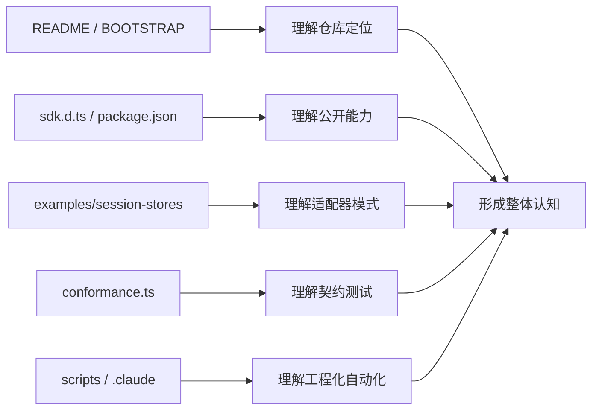

# 02 仓库地图与基线关系

## 本章抓手

你需要知道每个目录为什么存在。知道这一点后，后面的章节几乎都会顺下来。

## 仓库一句话结构

这个仓库 = 上游 Claude Agent SDK 的实验室快照 + 已发布 npm 包的可读镜像 + 三个会话存储参考实现。

## 先把高频名词认清

| 名词 | 含义 | 在本仓库里的阅读价值 |
| --- | --- | --- |
| upstream | Anthropic 官方仓库和官方发布来源 | 用来理解这套代码从哪里来，以及后续如何对齐更新 |
| snapshot | 某个时间点固定下来的上游副本 | 用来保证复现、对比和版本追踪 |
| SDK | 给开发者调用的一套接口、类型和运行能力 | 用来理解这套仓库的公开能力边界 |
| npm 包 | 发布到 Node.js 生态、可通过 npm install 安装的软件包 | 用来理解真正被项目安装和消费的发布形态 |
| 发布工件 | 真正被打包出去的文件，如 .mjs、.d.ts、manifest | 用来定位运行入口和类型入口 |
| baseline | 后续扩展和实验对比的起点实现 | 用来给实验设计和论文比较提供参照 |

## 为什么这里要同时保留 GitHub 快照和 npm 包

| 材料 | 你能看到什么 | 教学价值 |
| --- | --- | --- |
| 上游仓库快照 | README、CHANGELOG、examples、目录结构 | 适合看项目定位、版本脉络、公开示例 |
| npm 包镜像 | sdk.d.ts、sdk.mjs、assistant.d.ts、package.json | 适合看真正发布给开发者的接口面和构件 |

这一步对研究生尤其重要。很多同学会默认“GitHub 仓库长什么样，安装到本地就长什么样”。工程里真正被依赖解析和程序运行消费的，是发布工件这一层的文件集合。

## 读目录前，先认三类常见文件

| 文件类型 | 作用 | 为什么先看它 |
| --- | --- | --- |
| package.json | 包元数据、依赖、入口、脚本 | 它用来确认这个目录已经具备可安装、可运行的 npm package 结构 |
| .d.ts | TypeScript 类型声明文件 | 它最适合教学，因为接口、字段、类型边界一眼可见 |
| .mjs | ESM JavaScript 模块文件 | 它更接近实际运行构件，能告诉你发布后的执行入口在哪里 |

## 目录职责

| 路径 | 角色 | 为什么重要 |
| --- | --- | --- |
| ../README.md | 根入口 | 说明仓库来自 Claude Agent SDK，也定义了读者首先看到的项目叙事 |
| ../INPLUSLAB_BOOTSTRAP.md | 基线说明 | 说明上游版本、快照时间、为什么同时保留 GitHub 与 npm 构件 |
| ../third_party/claude-agent-sdk-npm/package | 公开 API 与发布工件 | 这里有 sdk.d.ts、assistant.d.ts、sdk.mjs、package.json，是理解“发布给开发者的真实接口面”的关键区域 |
| ../examples/session-stores | 参考适配器 | 展示如何把 SessionStore 接到 Redis、Postgres、S3，也展示了“接口和后端解耦”的标准做法 |
| ../examples/session-stores/shared/conformance.ts | 契约测试 | conformance 可以理解为“一致性达标测试”，定义一个合格 SessionStore 至少必须满足什么行为 |
| ../scripts | 维护脚本 | 用于 GitHub issue/label 操作，展示受限脚本包装；教学重点仍放在 SDK 接口和 SessionStore 上 |
| ../.claude/commands | 命令化提示词 | 展示仓库在工具链侧如何把 prompt 配成自动化任务，也能看出 prompt 如何被工程化约束 |
| ../CHANGELOG.md | 版本脉络 | 看新增能力何时进入 SDK，例如 sessionStore、promptSuggestions、hook events |

## 为什么没有自己的 src

因为当前策略是“先保留干净上游，再在其上分层扩展”。这在研究和实验室环境里是很合理的：

- 容易和 upstream 对比差异。
- 容易复现实验基线。
- 容易把实验层与官方行为边界切开。

这也正是 ../INPLUSLAB_BOOTSTRAP.md 反复强调的思路。

## 三层视角理解这个仓库

| 层 | 去哪里看 | 你实际上在学什么 |
| --- | --- | --- |
| 公开接口层 | ../third_party/claude-agent-sdk-npm/package/sdk.d.ts | query、Options、AgentDefinition、SessionStore、PermissionMode 这些公开抽象 |
| 参考实现层 | ../examples/session-stores | SDK 不规定后端细节时，一个合格适配器应该怎么写 |
| 工程约束层 | ../.claude/commands/label-issue.md 与 ../scripts/gh.sh | prompt、权限、脚本如何一起组成可控流程 |

## 一张图看仓库角色分工

## 对学生最值得盯的文件

- ../third_party/claude-agent-sdk-npm/package/sdk.d.ts
- ../examples/session-stores/README.md
- ../examples/session-stores/shared/conformance.ts
- ../examples/session-stores/redis/src/RedisSessionStore.ts
- ../examples/session-stores/postgres/src/PostgresSessionStore.ts
- ../examples/session-stores/s3/src/S3SessionStore.ts

## 本章小结

仓库真正值得学的地方，是“上游基线 + 发布工件 + 参考实现 + 契约测试”这四层如何拼成一套可研究、可扩展的底板。公开抽象是否清晰、参考实现是否可验证，正是这类研究型系统仓库的核心质量。