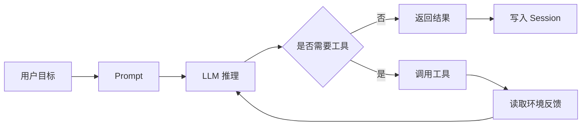

# 03 补齐背景：LLM、Agent、Tool、Session、MCP

## 本章抓手

如果你第一次接触 Agent，最常见的问题不是“不会写代码”，而是“名词全都认识，放在一起就糊了”。这一章就是把它们压缩成一张能长期使用的概念图。

## 五个最关键的概念

### 1. LLM

LLM 是会生成文本的模型。它擅长理解指令、归纳上下文、生成计划，但它本身并不会直接读你的仓库、写你的文件或执行终端命令。

### 2. Tool

Tool 是模型可调用的外部能力。比如 Read、Edit、Bash、WebFetch。工具让模型从“只会说”变成“能做事”。

### 3. Agent

Agent 不是另一个模型，而是“模型 + 工具 + 循环控制 + 状态”的组合体。它像一个能自己走几步的程序，而不是一次性的 API 调用。

### 4. Session

Session 是一段连续任务的轨迹。它记录用户说了什么、模型做了什么、调用了哪些工具、最后停在哪里。它像飞行记录仪。

### 5. MCP

MCP 是 Model Context Protocol。可以把它看成“模型接外设的统一协议”。如果 Tool 是插头，MCP 就是插座标准。

## 一个最有用的类比

- 模型像大脑。
- 工具像手。
- Session 像黑匣子。
- Hooks 像拦截器。
- SessionStore 像外接存储。
- MCP 像设备总线。

## 这些概念在仓库里如何落地

| 概念 | 仓库锚点 | 你应该观察什么 |
| --- | --- | --- |
| Agent | ../third_party/claude-agent-sdk-npm/package/sdk.d.ts | query、AgentDefinition、Options |
| Tool | ../third_party/claude-agent-sdk-npm/package/sdk.d.ts | tools、allowedTools、canUseTool、permissionMode |
| Session | ../third_party/claude-agent-sdk-npm/package/sdk.d.ts | resume、sessionId、SDKMessage |
| SessionStore | ../third_party/claude-agent-sdk-npm/package/sdk.d.ts | append/load/listSessions/delete/listSubkeys |
| MCP | ../third_party/claude-agent-sdk-npm/package/sdk.d.ts | mcpServers、onElicitation、相关 hook/event |

## Agent 的最小闭环

## 初学者最容易混淆的三件事

### 模型不等于 Agent

模型只是 Agent 的计算核心。没有工具与状态时，它只是一次响应器。

### Workflow 不等于 Agent

一个固定工作流可以完全没有自主性；一个 Agent 则需要根据上下文决定下一步要不要读文件、要不要跑命令、要不要再问人。

### Memory 不等于向量数据库

在这个仓库里，你先看到的是 Session 和 SessionStore，也就是“会话轨迹的镜像与恢复”。这和很多论文里说的检索记忆不是一回事，但二者可以组合。

## 本章小结

读完这一章，你应该能用一句话描述本仓库：它提供了一套让模型变成可执行 Agent 的接口面，以及围绕会话状态和扩展能力的工程机制。