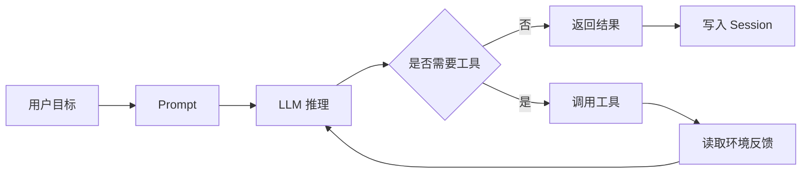

# 03 补齐背景：LLM、Agent、Tool、Session、MCP

## 本章抓手

第一次接触 Agent 时，最常见的卡点是名词很多、关系不清。这一章把核心概念压缩成一张能长期使用的概念图。

## 核心概念速览

| 概念 | 作用 | 在流程中的位置 | 在仓库里先看哪里 |
| --- | --- | --- | --- |
| LLM | 负责理解提示并生成下一步文本 | 位于推理核心，决定任务中的语言和计划 | 本章先建立概念，再回到 [04-first-query.md](04-first-query.md) 看它如何进入执行循环 |
| Tool | 负责执行读文件、改文件、跑命令、访问网络等外部动作 | 位于模型与真实环境之间 | ../third_party/claude-agent-sdk-npm/package/sdk.d.ts 里的 tools、allowedTools、canUseTool |
| Agent | 负责把模型、工具、状态和控制循环组织成可执行任务 | 贯穿整个任务生命周期 | ../third_party/claude-agent-sdk-npm/package/sdk.d.ts 里的 query、AgentDefinition、Options |
| Session | 负责记录一次连续任务的运行轨迹 | 位于执行过程、恢复机制和可观测性之间 | ../third_party/claude-agent-sdk-npm/package/sdk.d.ts 里的 sessionId、resume、SDKMessage |
| SessionStore | 负责把会话轨迹镜像到外部存储，并在需要时支持恢复 | 位于本地 transcript 与外部存储之间 | [09-session-store-contract.md](09-session-store-contract.md) |
| Hook | 负责在生命周期节点上插入额外逻辑，例如记录、审批、阻断或补充上下文 | 位于执行流程的关键事件点 | [07-agents-hooks-mcp.md](07-agents-hooks-mcp.md) 和 sdk.d.ts 里的 HookEvent |
| MCP | 负责接入外部工具与服务 | 位于 Agent 与外部能力之间 | [07-agents-hooks-mcp.md](07-agents-hooks-mcp.md) 和 sdk.d.ts 里的 mcpServers |

## 一个最有用的类比

| 抽象 | 类比 |
| --- | --- |
| LLM | 大脑 |
| Tool | 手 |
| Session | 黑匣子 |
| Hook | 拦截器 |
| SessionStore | 外接存储 |
| MCP | 设备总线 |

## Agent 的最小闭环

## 初学者最容易混淆的三组概念

| 容易混淆的说法 | 正确区分 | 在本仓库里的体现 |
| --- | --- | --- |
| 模型 = Agent | 模型提供推理核心；Agent 还要把工具、状态和控制循环组织起来 | query 返回的是一个完整运行过程，能串起工具、状态和回合控制 |
| Workflow = Agent | 固定工作流侧重预先编排；Agent 会根据上下文临场决定下一步动作 | tool 调用、权限判断和 resume 说明它具备决策与状态管理 |
| Memory = 向量数据库 | 这里先出现的是 Session 与 SessionStore，也就是会话轨迹镜像与恢复 | [08-message-stream-and-resume.md](08-message-stream-and-resume.md) 和 [09-session-store-contract.md](09-session-store-contract.md) 重点在轨迹恢复，检索式记忆可以在此基础上继续扩展 |

## 如果只想先记住一句话

LLM 负责想，Tool 负责做，Session 负责记，Hook 负责拦，SessionStore 负责外存，MCP 负责接外设；把这些拼起来，才叫 Agent 系统。

## 本章小结

读完这一章，你应该能用一句话描述本仓库：它提供了一套让模型变成可执行 Agent 的接口面，以及围绕会话状态和扩展能力的工程机制。