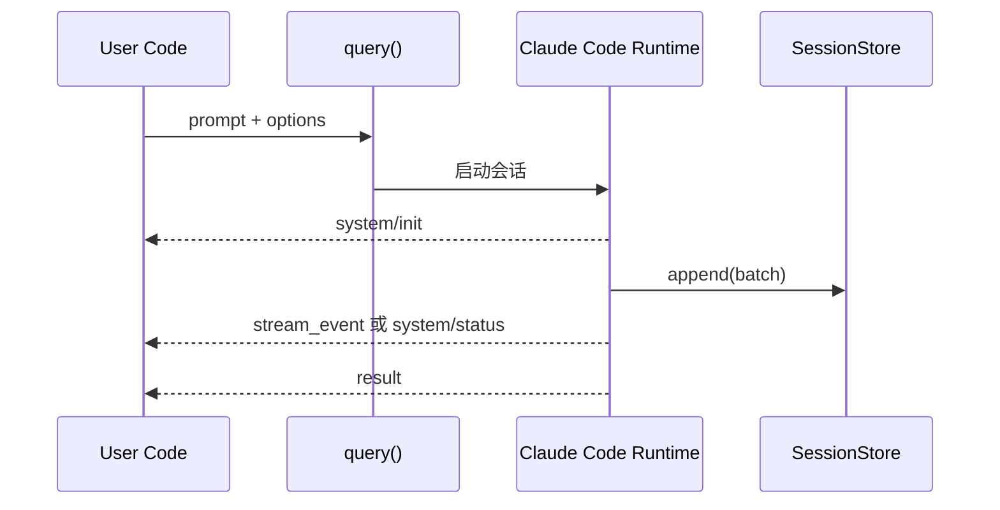

# 04 从 query() 开始：一次最小 Agent 调用

## 本章抓手

无论后面有多少复杂能力，入口都是 query()。如果你能读懂 query() 的输入、输出和最小运行轨迹，整个仓库就有了骨架。

## 入口签名

在 ../third_party/claude-agent-sdk-npm/package/sdk.d.ts 里，最重要的声明之一是：

```ts
export declare function query(_params: {
    prompt: string | AsyncIterable<SDKUserMessage>;
    options?: Options;
}): Query;
```

这句很短，但信息量很大：

- 你可以给它一个字符串 prompt，也可以给它一个用户消息流。
- 你可以用 options 改写几乎所有运行边界。
- 它返回的不是 Promise，而是 Query。也就是说，这不是“一问一答式”接口，而是一个可持续输出消息的会话对象。

## Query 为什么不是 Promise

因为 Agent 运行不是单点事件，而是一个过程。过程中可能出现：

- system/init，告诉你 session 已经建起来了。
- stream_event，告诉你模型正在流式输出。
- hook 或 task 相关消息，告诉你拦截器或子任务正在运行。
- result，告诉你这一轮收束了。

因此最自然的消费方式是：

```ts
for await (const m of query({ prompt, options })) {
  // 根据消息类型处理
}
```

## 仓库里的最小可运行样子

看 ../examples/session-stores/redis/demo.ts，可以看到一个非常好的教学版本：

```ts
async function run(prompt: string, resume?: string) {
  let sessionId: string | undefined
  for await (const m of query({
    prompt,
    options: { sessionStore: store, resume, maxTurns: 1 },
  })) {
    if (m.type === 'system' && m.subtype === 'init') sessionId = m.session_id
    if (m.type === 'result') {
      console.log(`[${m.subtype}]`, 'result' in m ? m.result : '')
    }
  }
  return sessionId
}
```

你应该注意三个动作：

- 从 init 消息里拿 sessionId。
- 从 result 消息里拿最终结果。
- 下一轮调用时把 sessionId 塞进 resume，形成连续会话。

## 一次调用的时序图



## 为什么示例里把 maxTurns 设成 1

因为教学时我们常常先把循环压扁。让一次 query 尽快返回，便于观察 sessionId、result、resume 的关系。等概念稳定后，再放开回合数。

## 读 query() 时要盯的三个问题

- 输入是一次性 prompt，还是连续用户消息流。
- 输出里哪些 message subtype 对你的应用最关键。
- 会话是临时跑一次，还是要被 resume、fork、持久化。

## 本章小结

query() 是整个 SDK 的门把手。掌握它，不等于掌握一切；但不掌握它，后面所有概念都会像漂在空中。