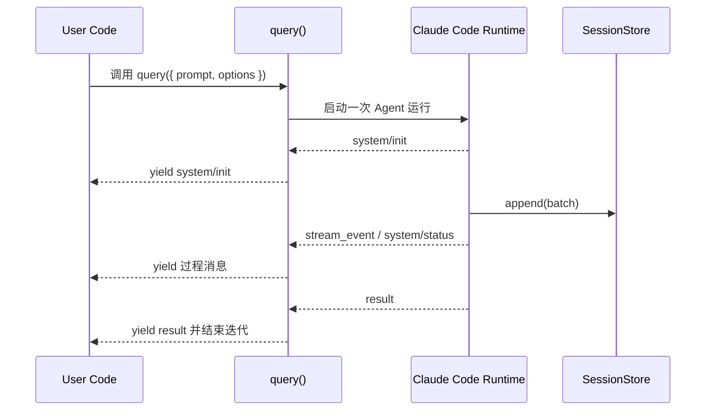

# 04 从 query() 开始：一次最小 Agent 调用

## 本章抓手

无论后面有多少复杂能力，入口都是 query()。如果你能读懂 query() 的输入、输出和最小运行轨迹，整个仓库就有了骨架。

> Claude Code之所以用 typescript作为 SDK 语言，而不是更常见的 Python，主要是因为它的运行时环境也是用 TypeScript 写的。这样 SDK 和运行时能共享类型定义，减少了跨语言接口的复杂度，同时也能更快地迭代和调试。对于用户来说，虽然可能需要适应一下 TypeScript 的语法，但从长远来看，这种设计能提供更一致和高效的开发体验。
## 入口签名

在 ../third_party/claude-agent-sdk-npm/package/sdk.d.ts 里，最重要的声明之一是：


<style>
.code-tabs {
  margin: 16px 0;
  border: 1px solid #d0d7de;
  border-radius: 8px;
  overflow: hidden;
}

.code-tabs input {
  display: none;
}

.code-tabs .tab-labels {
  display: flex;
  background: #f6f8fa;
  border-bottom: 1px solid #d0d7de;
}

.code-tabs .tab-labels label {
  padding: 8px 14px;
  cursor: pointer;
  font-size: 14px;
  border-right: 1px solid #d0d7de;
}

.code-tabs .tab-panel {
  display: none;
  padding: 0;
}

.code-tabs pre {
  margin: 0;
  padding: 16px;
  overflow-x: auto;
}

#tab-ts:checked ~ .tab-labels label[for="tab-ts"],
#tab-py:checked ~ .tab-labels label[for="tab-py"] {
  background: white;
  font-weight: 600;
}

#tab-ts:checked ~ .tab-content .ts,
#tab-py:checked ~ .tab-content .py {
  display: block;
}
</style>
<div class="code-tabs">
<input type="radio" name="query-code-tab" id="tab-ts" checked>
<input type="radio" name="query-code-tab" id="tab-py">
<div class="tab-labels">
<label for="tab-ts">TypeScript</label>
<label for="tab-py">Python</label>
</div>
<div class="tab-content">
<div class="tab-panel ts">

```ts
export declare function query(_params: {
    prompt: string | AsyncIterable<SDKUserMessage>;
    options?: Options;
}): Query;
```

</div>
<div class="tab-panel py">

```py
def query(
    prompt: Union[str, AsyncIterable[SDKUserMessage]],
    options: Optional[Options] = None,
) -> Query:
```

</div>
</div>
</div>

> Union是Python里表示类型可以是多选一的意思，Optional[Options] 是说 options 这个参数可以是 Options 类型，也可以是 None（即可选）。所以这段代码的意思是：query 函数接受一个 prompt 参数，这个参数可以是字符串或者一个异步迭代器，另外还有一个可选的 options 参数，函数返回一个 Query 对象。
  - prompt 可以是一个字符串，也可以是一个异步用户消息流。
  - options 是一个可选对象，能改写运行边界。
  - AsyncIterable 让 prompt 支持边输入边修改的场景，适合用户在交互过程中逐步提供信息。比如说，“我想让模型帮我写一封邮件”，你可能先输入“帮我写一封邮件”，模型开始生成，然后你又补充说“收件人是老板，内容要正式一点”，这时异步迭代器就能很好地处理这种边输入边修改的场景。
  - 在调用的时候，如果需要异步输入，可以这样写：


```py
async def user_input():
    yield "帮我写一封邮件"
    await asyncio.sleep(1)  # 模拟用户思考时间
    yield "收件人是老板，内容要正式一点"
query(prompt=user_input())
```


## 为什么用 Query 对象

Agent 运行会经历初始化、流式输出、工具调用和结果收束等多个阶段。过程中可能出现：

- system/init，告诉你 session 已经建起来了。
- stream_event，告诉你模型正在流式输出。
- hook 或 task 相关消息，告诉你拦截器或子任务正在运行。
- result，告诉你这一轮收束了。

因此最自然的消费方式是：


```ts
for await (const m of query({ prompt, options })) {
  // 根据消息类型处理
}
```

python：

```py
async for m in query(prompt=prompt, options=options): 
    # query是一个异步迭代器，m是每次迭代得到的消息
```
python中异步迭代器本质上是一个实现了__aiter__和__anext__方法的对象，比如:
```py
class AsyncIterator:
    def __init__(self, data):
        self.data = data
        self.index = 0

    def __aiter__(self):
        return self

    async def __anext__(self):
        if self.index >= len(self.data):
            raise StopAsyncIteration
        value = self.data[self.index]
        self.index += 1
        return value
async def main():
    async for item in AsyncIterator([1, 2, 3]): 
        print(item) 
asyncio.run(main())
```


## 仓库里的最小可运行样子

看 ../examples/session-stores/redis/demo.ts，可以看到一个非常好的教学版本：


```ts
// Excerpt from examples/session-stores/redis/demo.ts
async function run(prompt: string, resume?: string) {
  let sessionId: string | undefined
  for await (const m of query({
    prompt,
    options: { sessionStore: store, resume, maxTurns: 1 },
  })) {
    if (m.type === 'system' && m.subtype === 'init') sessionId = m.session_id
    if (m.type === 'result') {
      console.log(`[${m.subtype}]`, 'result' in m ? m.result : '')
    }
  }
  return sessionId
}
```

```py
async def run(prompt: str, resume: Optional[str] = None) -> Optional[str]:
    session_id = None
    # sessionStore 是把会话镜像到外部存储的适配器，类比生活中的账本，resume 是继续上次会话的凭证
    # maxTurns表示这次调用最多进行多少轮对话，设成k则最多进行k轮用户-模型交互，超过后会自动收束并返回结果
    # m是每次迭代得到的消息，m.type是消息类型，m.subtype是消息子类型
    # system表示系统消息(系统这里指的是 SDK 内部的系统，可能是初始化、状态更新等)，init表示会话初始化，result表示结果消息
    # 例如一个m可能长这样：m = { type: "system", subtype: "init", session_id: "abc123" }，
    # 另一个m可能是 { type: "result", subtype: "final", result: "模型的回答" }
    async for m in query(prompt=prompt, options={"sessionStore": store, "resume": resume, "maxTurns": 1}): 
        if m.type == "system" and getattr(m, "subtype", None) == "init":
            session_id = m.session_id
        if m.type == "result":
            print(f"[{m.subtype}]", getattr(m, "result", ""))
    return session_id
```


> TypeScript 片段直接取自 [examples/session-stores/redis/demo.ts](examples/session-stores/redis/demo.ts#L1-L36)。下面两到四行要点说明紧随其后。

- 这段代码是一个最小的可运行示例，用来演示如何通过 `query()` 启动一次会话并捕获 `system/init` 与 `result` 消息。
- 关注点：`options.sessionStore`（把会话镜像到外部存储）、`system/init`（从中记录 `sessionId`）和 `result`（拿到最终输出）。
- 类比：把 `sessionId` 当作会话的“账本编号”，`resume` 就是下一次继续那本账的凭证。

你应该注意三个动作：

- 从 init 消息里拿 sessionId。
- 从 result 消息里拿最终结果。
- 下一轮调用时把 sessionId 塞进 resume，形成连续会话。

### 先把这段 run() 翻成白话

可以把这段代码按时间顺序读成 5 步：

1. 调用 `query({ prompt, options })`，把这次提问和运行配置交给 SDK。
2. 进入 `for await` 循环，开始一条一条接收运行过程中的消息。
3. 如果收到 `system/init`，说明会话已经创建，这时把 `sessionId` 记下来。
4. 如果收到 `result`，说明这次调用已经收束，这时把最终结果打印出来。
5. 循环结束后返回 `sessionId`，这样下一次调用就能用 `resume` 接着聊。

这里有一个很值得注意的小点：`run()` 返回的是 `sessionId`，模型答案已经在循环里打印出来。这个示例的教学目标是演示“如何继续上一轮会话”，所以它把会话标识留给下一次调用使用。

## 一次调用的时序图



### 先认清图里的四个角色

- `User Code`：你自己写的应用代码，例如示例里的 `run()`。
- `query()`：SDK 暴露给你的入口。它接住参数，驱动底层运行时，再把消息一个个交还给你。
- `Claude Code Runtime`：真正执行 Agent 的地方。推理、工具调用、回合控制都发生在这里。
- `SessionStore`：外部持久化适配器。示例里接的是 Redis，用来镜像会话条目，后面才能 `resume`。

### 这张时序图怎么读

按箭头顺序读就够了：

1. `User Code -> query()`：你的代码发起一次调用，传入 prompt 和 options。
2. `query() -> Runtime`：SDK 开始驱动底层运行时。
3. `Runtime -> query() -> User Code` 的第一条消息通常是 `system/init`。它表示会话已经建立，所以示例会在这里拿到 `sessionId`。
4. `Runtime -> SessionStore` 的 `append(batch)` 表示运行时把本轮新增的会话条目镜像到外部存储。这个动作发生在你配置了 `sessionStore` 的前提下。
5. `Runtime -> query() -> User Code` 持续送出过程消息。常见的是 `stream_event` 或 `system/status`，它们让你看到“现在正在发生什么”。
6. 最后一条关键消息是 `result`。这表示本次 `query()` 已经收束，`for await` 也会随后结束。

### 为什么图里没有很多来回箭头

这张图故意只保留主干路径，目的是先让你看清一次最小调用的骨架。真实运行里还可能出现工具调用、hook 事件、子 Agent 任务和更多状态消息。等你读到 [08-message-stream-and-resume.md](08-message-stream-and-resume.md) 和 [09-session-store-contract.md](09-session-store-contract.md)，再把这些分支加回来，会更容易消化。


## 读 query() 时要盯的三个问题

- 输入是一次性 prompt，还是连续用户消息流。
- 输出里哪些 message subtype 对你的应用最关键。
- 会话是临时跑一次，还是要被 resume、fork、持久化。

## 本章小结

query() 是整个 SDK 的门把手。先读懂它，后面的状态、权限、持久化和扩展能力就都有了落点。
