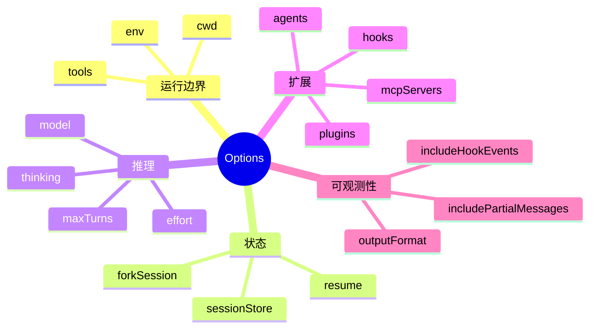
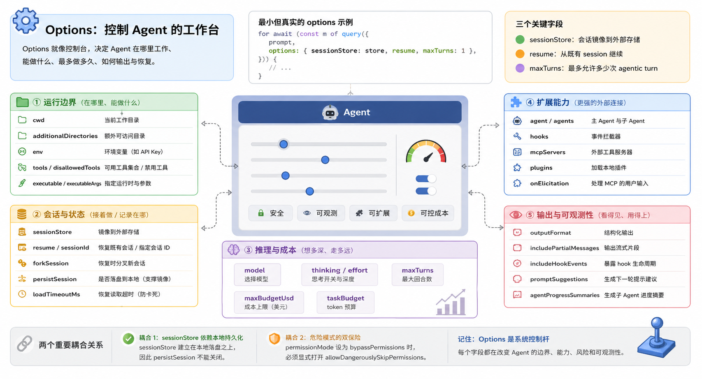

# 05 Options：把 Agent 调成你要的样子

## 本章抓手

如果说 query() 是门把手，那么 Options 就是控制台。你几乎可以通过它决定 Agent 的工作目录、可用工具、权限模式、恢复方式、输出格式、模型和扩展接口。

## 先看一个最小但真实的 options

来自 ../examples/session-stores/redis/demo.ts 里的调用现场。Python 版本是教学等价写法，用来帮你迁移语法；当前仓库实际代码仍以 TypeScript 为准。

<style>
.code-tabs {
  margin: 16px 0;
  border: 1px solid #d0d7de;
  border-radius: 8px;
  overflow: hidden;
}

.code-tabs input {
  display: none;
}

.code-tabs .tab-labels {
  display: flex;
  background: #f6f8fa;
  border-bottom: 1px solid #d0d7de;
}

.code-tabs .tab-labels label {
  padding: 8px 14px;
  cursor: pointer;
  font-size: 14px;
  border-right: 1px solid #d0d7de;
}

.code-tabs .tab-panel {
  display: none;
  padding: 0;
}

.code-tabs pre {
  margin: 0;
  padding: 16px;
  overflow-x: auto;
}

#options-tab-ts:checked ~ .tab-labels label[for="options-tab-ts"],
#options-tab-py:checked ~ .tab-labels label[for="options-tab-py"] {
  background: white;
  font-weight: 600;
}

#options-tab-ts:checked ~ .tab-content .ts,
#options-tab-py:checked ~ .tab-content .py {
  display: block;
}
</style>
<div class="code-tabs">
<input type="radio" name="options-code-tab" id="options-tab-ts" checked>
<input type="radio" name="options-code-tab" id="options-tab-py">
<div class="tab-labels">
<label for="options-tab-ts">TypeScript</label>
<label for="options-tab-py">Python</label>
</div>
<div class="tab-content">
<div class="tab-panel ts">

```ts
for await (const m of query({
  prompt,
  options: { sessionStore: store, resume, maxTurns: 1 },
})) {
  // ...
}
```

</div>
<div class="tab-panel py">

```py
async for m in query(
    prompt=prompt,
    options={
        "sessionStore": store,
        "resume": session_id,
        "maxTurns": 1,
    },
):
    ...
```

</div>
</div>
</div>

> 这一小段已经把三个最关键的 options 字段摆出来了。它没有展示全部能力，但非常适合入门，因为“会话镜像”“恢复旧会话”“限制回合数”这三件事已经连起来了。

- `sessionStore` 决定这次会话是否要顺手镜像到外部存储。
- `resume` 决定这次是不是接着旧 session 继续跑。
- `maxTurns` 决定这一轮最多允许多少次 agentic turn。

你可以把 Options 想成实验台上的控制面板。`prompt` 像你要交给实验对象的问题，`options` 像你提前拨好的旋钮。旋钮不负责回答问题，但它决定实验在哪个环境里做、最多做多久、能不能接着上一次实验继续做。

## 不要把 Options 当参数堆

更好的读法是分五组来看。

## 第一组：运行边界

| 字段 | 作用 | 教学理解 |
| --- | --- | --- |
| cwd | 当前工作目录 | Agent 默认把这里当成主要操作现场 |
| additionalDirectories | 额外可访问目录 | 给 Agent 扩边界，但不要无限放大 |
| env | 传给运行时的环境变量 | 常用于 API key、标识应用、实验配置 |
| executable / executableArgs | 指定运行时 | 控制 Claude Code 用 bun、node 还是 deno 启动 |
| tools / disallowedTools | 改写可用工具集合 | 一开一关，决定 Agent 能做什么 |

## 第二组：会话与状态

| 字段 | 作用 | 关键提醒 |
| --- | --- | --- |
| sessionStore | 把会话镜像到外部存储 | 本仓库最值得学的工程点 |
| resume | 从既有 session 继续 | 和 continue 互斥 |
| sessionId | 指定会话 ID | 做复现实验时很有用 |
| forkSession | 恢复时分叉新会话 | 适合做“从某一步重新探索” |
| persistSession | 是否落盘到本地 | 设为 false 时不能再配 sessionStore |
| loadTimeoutMs | 恢复读取超时 | 防止 resume 卡死 |

## 第三组：推理与成本

| 字段 | 作用 | 教学理解 |
| --- | --- | --- |
| model | 选择模型 | 不同能力、速度、成本的平衡点 |
| thinking | 控制扩展思考 | 新接口，优先于旧的 maxThinkingTokens |
| effort | 控制思考深度 | 类似告诉模型“你要不要更认真” |
| maxTurns | 最大回合数 | 限制 Agent 走太远 |
| maxBudgetUsd | 成本上限 | 实验时很有价值 |
| taskBudget | token 预算 | 让模型有预算意识 |

## 第四组：扩展能力

| 字段 | 作用 | 对应章节 |
| --- | --- | --- |
| agent / agents | 主 Agent 与子 Agent 定义 | 见 [07-agents-hooks-mcp.md](07-agents-hooks-mcp.md) |
| hooks | 事件拦截器 | 见 [07-agents-hooks-mcp.md](07-agents-hooks-mcp.md) |
| mcpServers | 外部工具服务器 | 见 [07-agents-hooks-mcp.md](07-agents-hooks-mcp.md) |
| plugins | 加载本地插件 | 扩展命令、技能、hooks |
| onElicitation | 处理 MCP 的用户输入请求 | 常见于鉴权或表单型交互 |

## 第五组：输出与可观测性

| 字段 | 作用 | 为什么重要 |
| --- | --- | --- |
| outputFormat | 结构化输出 | 适合评测、下游解析、论文复现 |
| includePartialMessages | 输出流式片段 | 适合做实时 UI |
| includeHookEvents | 暴露 hook 生命周期 | 适合调试与研究观测 |
| promptSuggestions | 生成下一轮 prompt 建议 | 适合交互式产品探索 |
| agentProgressSummaries | 生成子 Agent 进度摘要 | 适合多任务可视化 |

## 两个非常值得记住的耦合关系

### 耦合 1：sessionStore 与 persistSession

sessionStore 建立在本地持久化之上：本地 transcript 先落盘，再把内容镜像到外部存储。因此 persistSession 不能关掉，否则镜像触发前提就没了。

### 耦合 2：bypassPermissions 与 allowDangerouslySkipPermissions

如果你把 permissionMode 设成 bypassPermissions，必须显式打开 allowDangerouslySkipPermissions。这个双开关设计本质上是在防止你误把危险模式带进生产。

## 一张 Options 心智图



## 本章小结

Options 可以看成一组系统控制杆。你每拨动一个字段，实际上都在改变 Agent 的边界、能力、风险和可观测性。
