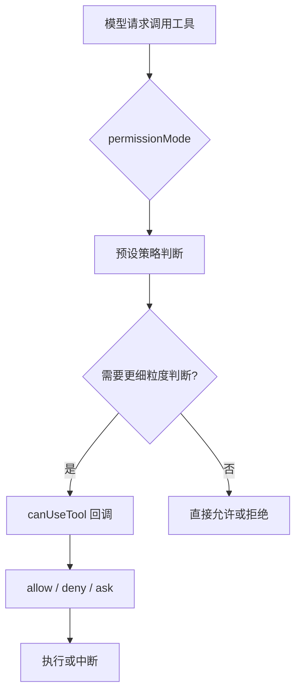

# 06 权限模式、沙箱与 Human-in-the-loop

## 本章抓手

Agent 真正进入工程环境后，最先要解决的是工具调用由谁批准、出错时由谁兜底。这个仓库把这件事设计得相当明确。

## 权限为什么是 Agent 的核心

普通聊天模型输出错了，最多是答案不对。Agent 调错工具，可能会：

- 改错文件。
- 读到不该读的目录。
- 发起不该发起的网络请求。
- 在终端里执行危险命令。

因此权限系统是 Agent 框架的地基。

## PermissionMode 六种模式

在 ../third_party/claude-agent-sdk-npm/package/sdk.d.ts 中，PermissionMode 定义为：

下面先直接看一眼真实类型。Python 版本仍然是教学等价写法，目的是帮助你把语法和概念对上。

<style>
.code-tabs {
  margin: 16px 0;
  border: 1px solid #d0d7de;
  border-radius: 8px;
  overflow: hidden;
}

.code-tabs input {
  display: none;
}

.code-tabs .tab-labels {
  display: flex;
  background: #f6f8fa;
  border-bottom: 1px solid #d0d7de;
}

.code-tabs .tab-labels label {
  padding: 8px 14px;
  cursor: pointer;
  font-size: 14px;
  border-right: 1px solid #d0d7de;
}

.code-tabs .tab-panel {
  display: none;
  padding: 0;
}

.code-tabs pre {
  margin: 0;
  padding: 16px;
  overflow-x: auto;
}

#permission-tab-ts:checked ~ .tab-labels label[for="permission-tab-ts"],
#permission-tab-py:checked ~ .tab-labels label[for="permission-tab-py"] {
  background: white;
  font-weight: 600;
}

#permission-tab-ts:checked ~ .tab-content .ts,
#permission-tab-py:checked ~ .tab-content .py {
  display: block;
}
</style>
<div class="code-tabs">
<input type="radio" name="permission-code-tab" id="permission-tab-ts" checked>
<input type="radio" name="permission-code-tab" id="permission-tab-py">
<div class="tab-labels">
<label for="permission-tab-ts">TypeScript</label>
<label for="permission-tab-py">Python</label>
</div>
<div class="tab-content">
<div class="tab-panel ts">

```ts
export declare type PermissionMode =
  | 'default'
  | 'acceptEdits'
  | 'bypassPermissions'
  | 'plan'
  | 'dontAsk'
  | 'auto';
```

</div>
<div class="tab-panel py">

```py
PermissionMode = Literal[
    "default",
    "acceptEdits",
    "bypassPermissions",
    "plan",
    "dontAsk",
    "auto",
]
```

</div>
</div>
</div>

> `Literal[...]` 在 Python 里表示“这个值只能从几个固定候选里选”。所以这里表达的是：权限模式不是自由文本，而是一组事先定义好的运行策略。

- default：标准模式，危险操作需要确认。
- acceptEdits：自动接受文件编辑类操作。
- bypassPermissions：跳过所有权限检查，但必须显式允许。
- plan：只规划，不真正执行工具。
- dontAsk：不弹询问，未预授权就拒绝。
- auto：由模型分类器决定是否批准。

把这六种模式想成实验室门禁会比较容易：

- `default` 像普通门禁，关键操作要刷卡确认。
- `plan` 像先走彩排路线，只讲步骤，不开机器。
- `dontAsk` 像“没在白名单里就不放行”。
- `bypassPermissions` 像总控钥匙，只适合受控环境。

## 这六种模式怎么理解

### default

最像真实人机协作。适合教学和调试。

### plan

最适合课堂演示。因为它把“会做什么”与“真的去做”分开了。

### dontAsk

适合自动化流程中的保守模式。没有白名单就不放行。

### bypassPermissions

适合完全受控的离线实验，不适合直接进入真实生产环境。

## canUseTool：把审批逻辑交给你

除了静态 mode，SDK 还暴露了 canUseTool 回调。它会在每次工具执行前被调用，你可以根据：

- toolName
- input
- blockedPath
- decisionReason
- title
- description

来决定这次工具是允许、拒绝还是让用户继续确认。

这就是典型的 Human-in-the-loop 接口：模型负责提议，人类或策略模块负责拍板。

## 沙箱与权限规则的分工

Options 里还有 sandbox 设置。它负责命令执行隔离。Read、Edit、WebFetch 的访问边界仍由权限规则控制。实际工程里，常见做法是把 sandbox 当作额外护栏，再用权限规则定义主控制面。

## 决策流程图



## 为什么这对论文也重要

权限控制本身就可以成为研究点，例如：

- 风险感知的工具审批。
- 基于上下文的动态权限收缩。
- Agent 自评估与人类审批协同。
- 不同 permission mode 对任务完成率与安全性的影响。

这类题目有一个优点：既能落到代码实现，也容易设计定量实验。

## 仓库中的相关锚点

- PermissionMode：../third_party/claude-agent-sdk-npm/package/sdk.d.ts
- CanUseTool：../third_party/claude-agent-sdk-npm/package/sdk.d.ts
- sandbox 设置：../third_party/claude-agent-sdk-npm/package/sdk.d.ts

## 本章小结

一个成熟的 Agent 框架会先确定系统能在什么边界内稳定放行，再讨论模型还能向上扩多远。这正是这一套权限接口存在的意义。
