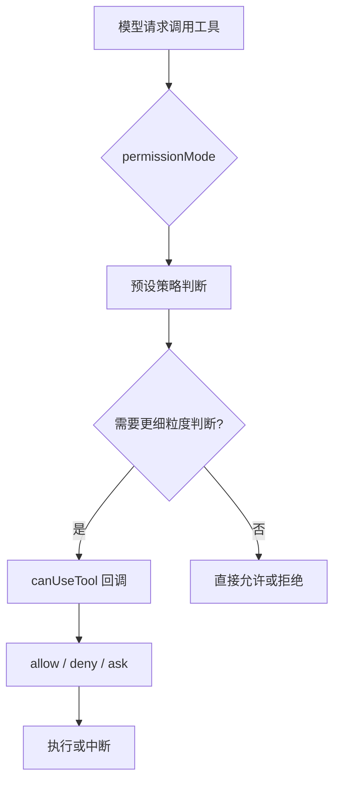

# 06 权限模式、沙箱与 Human-in-the-loop

## 本章抓手

Agent 真正进入工程环境后，第一大问题从来不是“它会不会写代码”，而是“它做错事时，谁来拦”。这个仓库把这个问题设计得相当明确。

## 权限为什么是 Agent 的核心

普通聊天模型输出错了，最多是答案不对。Agent 调错工具，可能会：

- 改错文件。
- 读到不该读的目录。
- 发起不该发起的网络请求。
- 在终端里执行危险命令。

因此权限系统不是附属品，而是 Agent 框架的地基。

## PermissionMode 六种模式

在 ../third_party/claude-agent-sdk-npm/package/sdk.d.ts 中，PermissionMode 定义为：

- default：标准模式，危险操作需要确认。
- acceptEdits：自动接受文件编辑类操作。
- bypassPermissions：跳过所有权限检查，但必须显式允许。
- plan：只规划，不真正执行工具。
- dontAsk：不弹询问，未预授权就拒绝。
- auto：由模型分类器决定是否批准。

## 这六种模式怎么理解

### default

最像真实人机协作。适合教学和调试。

### plan

最适合课堂演示。因为它把“会做什么”与“真的去做”分开了。

### dontAsk

适合自动化流程中的保守模式。没有白名单就不放行。

### bypassPermissions

适合完全受控的离线实验，不适合直接进入真实生产环境。

## canUseTool：把审批逻辑交给你

除了静态 mode，SDK 还暴露了 canUseTool 回调。它会在每次工具执行前被调用，你可以根据：

- toolName
- input
- blockedPath
- decisionReason
- title
- description

来决定这次工具是允许、拒绝还是让用户继续确认。

这就是典型的 Human-in-the-loop 接口：模型负责提议，人类或策略模块负责拍板。

## 沙箱不是权限系统的替代品

Options 里还有 sandbox 设置。它做的是命令执行隔离，而不是替代 Read/Edit/WebFetch 的权限规则。一个常见误区是：

- 错误理解：开了 sandbox，就万事大吉。
- 正确理解：sandbox 是额外护栏，权限规则仍然是主控制面。

## 决策流程图

## 为什么这对论文也重要

权限控制本身就可以成为研究点，例如：

- 风险感知的工具审批。
- 基于上下文的动态权限收缩。
- Agent 自评估与人类审批协同。
- 不同 permission mode 对任务完成率与安全性的影响。

这类题目有一个优点：既能落到代码实现，也容易设计定量实验。

## 仓库中的相关锚点

- PermissionMode：../third_party/claude-agent-sdk-npm/package/sdk.d.ts
- CanUseTool：../third_party/claude-agent-sdk-npm/package/sdk.d.ts
- sandbox 设置：../third_party/claude-agent-sdk-npm/package/sdk.d.ts

## 本章小结

一个成熟的 Agent 框架，不是先问“模型最强能做到什么”，而是先问“系统最稳能放行到什么程度”。这正是这一套权限接口存在的意义。