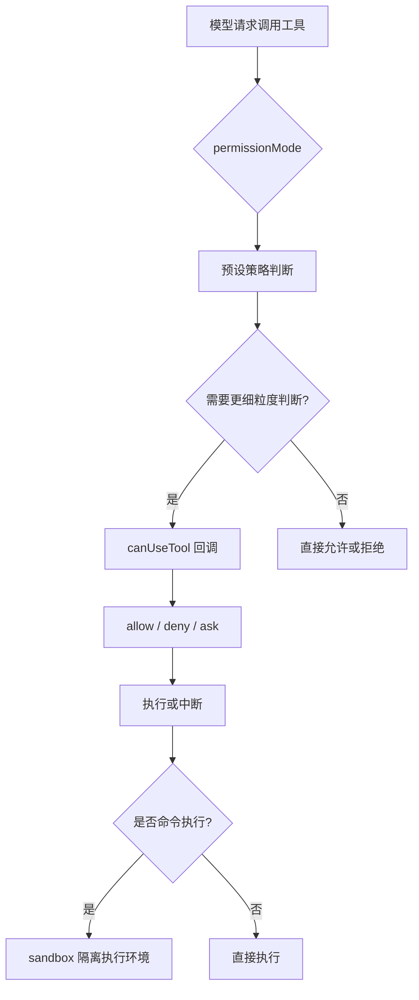

# 06 权限模式、沙箱与 Human-in-the-loop

## 本章抓手

Agent 真正进入工程环境后，最先要解决的是工具调用由谁批准、出错时由谁兜底。这个仓库把这件事设计得相当明确。

## 权限为什么是 Agent 的核心

普通聊天模型输出错了，最多是答案不对。Agent 调错工具，可能会：

- 改错文件。
- 读到不该读的目录。
- 发起不该发起的网络请求。
- 在终端里执行危险命令。

因此权限系统是 Agent 框架的地基。

## PermissionMode 六种模式

在 ../third_party/claude-agent-sdk-npm/package/sdk.d.ts 中，PermissionMode 定义为：

下面先直接看一眼真实类型。Python 版本仍然是教学等价写法，目的是帮助你把语法和概念对上。

<style>
.code-tabs {
  margin: 16px 0;
  border: 1px solid #d0d7de;
  border-radius: 8px;
  overflow: hidden;
}

.code-tabs input {
  display: none;
}

.code-tabs .tab-labels {
  display: flex;
  background: #f6f8fa;
  border-bottom: 1px solid #d0d7de;
}

.code-tabs .tab-labels label {
  padding: 8px 14px;
  cursor: pointer;
  font-size: 14px;
  border-right: 1px solid #d0d7de;
}

.code-tabs .tab-panel {
  display: none;
  padding: 0;
}

.code-tabs pre {
  margin: 0;
  padding: 16px;
  overflow-x: auto;
}

#permission-tab-ts:checked ~ .tab-labels label[for="permission-tab-ts"],
#permission-tab-py:checked ~ .tab-labels label[for="permission-tab-py"] {
  background: white;
  font-weight: 600;
}

#permission-tab-ts:checked ~ .tab-content .ts,
#permission-tab-py:checked ~ .tab-content .py {
  display: block;
}
</style>
<div class="code-tabs">
<input type="radio" name="permission-code-tab" id="permission-tab-ts" checked>
<input type="radio" name="permission-code-tab" id="permission-tab-py">
<div class="tab-labels">
<label for="permission-tab-ts">TypeScript</label>
<label for="permission-tab-py">Python</label>
</div>
<div class="tab-content">
<div class="tab-panel ts">

```ts
export declare type PermissionMode =
  | 'default'
  | 'acceptEdits'
  | 'bypassPermissions'
  | 'plan'
  | 'dontAsk'
  | 'auto';
```

</div>
<div class="tab-panel py">

```py
PermissionMode = Literal[
    "default",
    "acceptEdits",
    "bypassPermissions",
    "plan",
    "dontAsk",
    "auto",
]
```

</div>
</div>
</div>

> `Literal[...]` 在 Python 里表示“这个值只能从几个固定候选里选”。所以这里表达的是：权限模式不是自由文本，而是一组事先定义好的运行策略。

- default：标准模式，危险操作需要确认。
- acceptEdits：自动接受文件编辑类操作。
- bypassPermissions：跳过所有权限检查，但必须显式允许。
- plan：只规划，不真正执行工具。
- dontAsk：不弹询问，未预授权就拒绝。
- auto：由模型分类器决定是否批准。

把这六种模式想成实验室门禁会比较容易：

- `default` 像普通门禁，关键操作要刷卡确认。
- `plan` 像先走彩排路线，只讲步骤，不开机器。
- `dontAsk` 像“没在白名单里就不放行”。
- `bypassPermissions` 像总控钥匙，只适合受控环境。

## 这六种模式怎么理解

### default

最像真实人机协作。适合教学和调试。

### plan

最适合课堂演示。因为它把“会做什么”与“真的去做”分开了。

### dontAsk

适合自动化流程中的保守模式。没有白名单就不放行。

### bypassPermissions

适合完全受控的离线实验，不适合直接进入真实生产环境。

## canUseTool：把审批逻辑交给你

除了静态 mode，SDK 还暴露了 canUseTool 回调。它会在每次工具执行前被调用，你可以根据：

- toolName
- input
- blockedPath
- decisionReason
- title
- description

来决定这次工具是允许、拒绝还是让用户继续确认。

这就是典型的 Human-in-the-loop 接口：模型负责提议，人类或策略模块负责拍板。

## 沙箱与权限规则的分工

`sandbox` 解决的是“命令执行环境的隔离”，主要覆盖 Bash/子进程这一类高风险入口。它和权限规则之间是明确分工：

- Read/Edit/WebFetch 这类“能读什么、能写什么、能访问哪些域名”的边界，靠权限规则来表达。
- sandbox 这层提供“即使命令被允许执行，也尽量在受限环境里跑”的额外护栏，并补充一些运行期策略（启用、降级、合并路径等）。

SDK 在 `../third_party/claude-agent-sdk-npm/package/sdk.d.ts` 里把这层关系写得很清楚（建议把注释当成行为契约来读）：

<style>
#sandboxdoc-tab-ts:checked ~ .tab-labels label[for="sandboxdoc-tab-ts"],
#sandboxdoc-tab-py:checked ~ .tab-labels label[for="sandboxdoc-tab-py"] {
  background: white;
  font-weight: 600;
}

#sandboxdoc-tab-ts:checked ~ .tab-content .ts,
#sandboxdoc-tab-py:checked ~ .tab-content .py {
  display: block;
}
</style>
<div class="code-tabs">
<input type="radio" name="sandboxdoc-code-tab" id="sandboxdoc-tab-ts" checked>
<input type="radio" name="sandboxdoc-code-tab" id="sandboxdoc-tab-py">
<div class="tab-labels">
<label for="sandboxdoc-tab-ts">TypeScript</label>
<label for="sandboxdoc-tab-py">Python</label>
</div>
<div class="tab-content">
<div class="tab-panel ts">

```ts
// ../third_party/claude-agent-sdk-npm/package/sdk.d.ts (注释摘录)
// - sandbox 负责 command execution isolation
// - filesystem/network restrictions 主要通过 Read/Edit/WebFetch 权限规则配置
// - sandbox 选项负责启用/降级/行为开关，以及和权限规则的部分合并
sandbox?: SandboxSettings;
```

</div>
<div class="tab-panel py">

```py
# 教学等价写法（重点是“分工”，不是 SDK 真接口）
# permissions: 决定边界（读写/网络）
# sandbox:     决定命令是否在隔离环境运行，以及是否允许降级
permissions = {"allow": ["Read(./**)", "Edit(./generated/**)", "WebFetch(domain:example.com)"]}
sandbox = {"enabled": True, "failIfUnavailable": False}
```

</div>
</div>
</div>

### sandbox 的几个关键开关

从 settings schema 的字段注释看，工程里最常用、最容易踩坑的是这三类：

1) `enabled / failIfUnavailable`

- `enabled: true` 打开沙箱。
- `failIfUnavailable` 控制“沙箱不可用时怎么办”：硬失败退出，还是给出警告并允许命令不在沙箱里跑。

2) `allowUnsandboxedCommands`

它控制是否允许通过 `dangerouslyDisableSandbox` 这类机制把命令挪到沙箱外执行。受管环境通常会把它设成 `false`，让“必须沙箱化”成为硬约束。

3) filesystem/network 的补充合并项

`filesystem.allowWrite/denyRead/...` 和 `network.allowedDomains/deniedDomains/...` 会和权限规则产生合并关系，它们更适合用来表达“组织级基线 + 会话级例外”，而不是替代权限规则本身。

### 两个入口：Options.sandbox 与 settings.sandbox

同一套沙箱能力在工程里会从两个地方出现：

- SDK 入参：`Options.sandbox`，适合一次调用/一次会话的临时开关。
- settings：`settings.sandbox`，适合项目默认或受管策略下发。

下面用“同一个意图”的两种写法对照一下，便于你在排查问题时快速定位配置来源：

<style>
#sandboxentry-tab-sdk2:checked ~ .tab-labels label[for="sandboxentry-tab-sdk2"],
#sandboxentry-tab-settings2:checked ~ .tab-labels label[for="sandboxentry-tab-settings2"] {
  background: white;
  font-weight: 600;
}

#sandboxentry-tab-sdk2:checked ~ .tab-content .sdk,
#sandboxentry-tab-settings2:checked ~ .tab-content .settings {
  display: block;
}
</style>
<div class="code-tabs">
<input type="radio" name="sandboxentry2-code-tab" id="sandboxentry-tab-sdk2" checked>
<input type="radio" name="sandboxentry2-code-tab" id="sandboxentry-tab-settings2">
<div class="tab-labels">
<label for="sandboxentry-tab-sdk2">SDK Options</label>
<label for="sandboxentry-tab-settings2">settings.json</label>
</div>
<div class="tab-content">
<div class="tab-panel sdk">

```ts
import { query } from "../third_party/claude-agent-sdk-npm/package/sdk.js";

await query({
  cwd: process.cwd(),
  permissionMode: "default",
  sandbox: {
    enabled: true,
    autoAllowBashIfSandboxed: true,
    failIfUnavailable: false
  }
});
```

</div>
<div class="tab-panel settings">

```json
{
  "permissionMode": "default",
  "sandbox": {
    "enabled": true,
    "autoAllowBashIfSandboxed": true,
    "failIfUnavailable": false
  }
}
```

</div>
</div>
</div>

### settings 路径与 Options.sandbox 的互斥

如果你把 `Options.settings` 作为“settings 文件路径”传入，同时又传了 `Options.sandbox`，SDK 会直接报错并要求你把沙箱配置写进 settings 文件。这个限制来自 `../third_party/claude-agent-sdk-npm/package/assistant.mjs` 的合并逻辑。

## 决策流程图

<style>
#decisionflow-tab-mermaid:checked ~ .tab-labels label[for="decisionflow-tab-mermaid"],
#decisionflow-tab-text:checked ~ .tab-labels label[for="decisionflow-tab-text"] {
  background: white;
  font-weight: 600;
}

#decisionflow-tab-mermaid:checked ~ .tab-content .mermaid,
#decisionflow-tab-text:checked ~ .tab-content .text {
  display: block;
}
</style>
<div class="code-tabs">
<input type="radio" name="decisionflow-code-tab" id="decisionflow-tab-mermaid" checked>
<input type="radio" name="decisionflow-code-tab" id="decisionflow-tab-text">
<div class="tab-labels">
<label for="decisionflow-tab-mermaid">Mermaid</label>
<label for="decisionflow-tab-text">Text</label>
</div>
<div class="tab-content">
<div class="tab-panel mermaid">



</div>
<div class="tab-panel text">

```text
1) 先根据 permissionMode 做粗粒度策略（是否询问、是否只规划、是否自动放行等）
2) 需要更细粒度控制时进入 canUseTool（拿到 blockedPath/decisionReason/title/suggestions）
3) 得到 allow / deny / ask 后决定是否执行该工具调用
4) 若该调用会启动命令/子进程，sandbox 再决定命令是否在隔离环境运行，以及不可用时是否允许降级
```

</div>
</div>
</div>

## 为什么这对论文也重要

权限控制本身就可以成为研究点，例如：

- 风险感知的工具审批。
- 基于上下文的动态权限收缩。
- Agent 自评估与人类审批协同。
- 不同 permission mode 对任务完成率与安全性的影响。

这类题目有一个优点：既能落到代码实现，也容易设计定量实验。

## 仓库中的相关锚点

- PermissionMode：../third_party/claude-agent-sdk-npm/package/sdk.d.ts
- CanUseTool：../third_party/claude-agent-sdk-npm/package/sdk.d.ts
- sandbox 设置：../third_party/claude-agent-sdk-npm/package/sdk.d.ts
- sandbox 合并逻辑/互斥校验：../third_party/claude-agent-sdk-npm/package/assistant.mjs
- “命令是否运行在沙箱中”的标记：../third_party/claude-agent-sdk-npm/package/assistant.d.ts
## 本章小结

一个成熟的 Agent 框架会先确定系统能在什么边界内稳定放行，再讨论模型还能向上扩多远。这正是这一套权限接口存在的意义。
