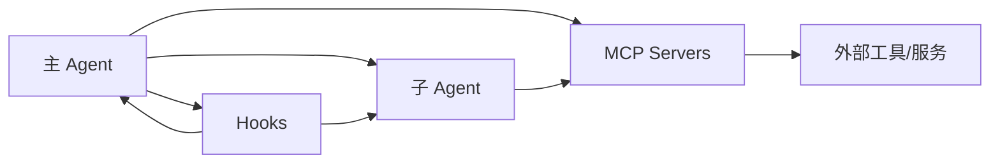

# 07 多 Agent、Hooks 与 MCP：三块最重要的扩展面

## 本章抓手

很多同学第一次读 Agent SDK 时，会把“子 Agent”“Hooks”“MCP”混成一件事。它们确实都在扩展系统，但扩展的位置完全不同。

## 先用一句话区分三者

- 子 Agent 解决的是“让谁来做这件事”。
- Hooks 解决的是“在某个事件点插入什么逻辑”。
- MCP 解决的是“系统如何接入新的外部能力”。

## 1. AgentDefinition：把任务交给另一个代理

在 ../third_party/claude-agent-sdk-npm/package/sdk.d.ts 里，AgentDefinition 至少包含这些关键字段：

- description
- prompt
- tools / disallowedTools
- model
- mcpServers
- skills
- initialPrompt
- maxTurns
- background
- memory
- effort
- permissionMode

这说明一个子 Agent 不是简单的“函数调用”，而是一个有自己角色、工具、模型、记忆范围和权限模式的独立工作单元。

## 2. Hooks：在事件节点上插逻辑

SDK 暴露了很多 HookEvent，例如：

- PreToolUse
- PostToolUse
- PermissionRequest
- PermissionDenied
- SessionStart
- SessionEnd
- SubagentStart
- SubagentStop
- Elicitation
- ConfigChange
- FileChanged

这意味着你可以在 Agent 生命周期中的许多节点观察、拦截、补充上下文或改写行为。

## 3. MCP：给 Agent 插外设

MCP 是把外部能力统一接入模型环境的协议层。你可以把自定义服务器挂进 mcpServers，让 Agent 像调用内置工具一样调用外部服务。

最直接的价值是：

- 能接数据库。
- 能接浏览器。
- 能接检索系统。
- 能接你们实验室自己的分析器、代码审查器、评测器。

## 三者如何配合

## 为什么这三块对研究最有吸引力

### 子 Agent

适合研究任务分解、角色分工、协作失败恢复。

### Hooks

适合研究过程控制、策略注入、可观测性与行为审计。

### MCP

适合研究外部知识、工具增强、系统集成与现实场景落地。

## 一个很有意思的辅助材料

仓库里还有 ../.claude/commands/label-issue.md。它不是 SDK 层的子 Agent 定义，但它展示了另一种很值得学习的思想：把 prompt、脚本和工作流绑定成“命令化自动化单元”。

再配合 ../scripts/gh.sh 这种受限包装脚本，你可以看到一条非常清楚的工程主线：

- 提示词负责决策框架。
- 脚本负责收缩工具边界。
- 权限系统负责防止越界。

## 给学生的实践建议

- 先不要一上来就设计多 Agent 系统。
- 先用一个 Hook 把某类工具调用打印出来。
- 再加一个简单子 Agent 做单一职责任务。
- 最后再接 MCP，把外部能力接进来。

这个顺序最稳，因为每一步都能单独验证。

## 本章小结

子 Agent、Hooks、MCP 共同决定了这个 SDK 的扩展上限。一个负责分工，一个负责拦截，一个负责接外设，三者合起来才构成真正可研究、可工程化的 Agent 平台。