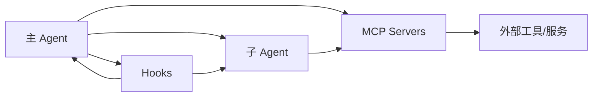

# 07 多 Agent、Hooks 与 MCP：三块最重要的扩展面

## 本章抓手

很多同学第一次读 Agent SDK 时，会把“子 Agent”“Hooks”“MCP”混成一件事。它们确实都在扩展系统，但扩展的位置完全不同。

## 先用一句话区分三者

- 子 Agent 解决的是“让谁来做这件事”。
- Hooks 解决的是“在某个事件点插入什么逻辑”。
- MCP 解决的是“系统如何接入新的外部能力”。

## 1. AgentDefinition：把任务交给另一个代理

在 ../third_party/claude-agent-sdk-npm/package/sdk.d.ts 里，AgentDefinition 至少包含这些关键字段：

先直接看骨架会更快。Python 版本是教学等价写法，用来帮助你把“字段像什么”看清楚。

<style>
.code-tabs {
  margin: 16px 0;
  border: 1px solid #d0d7de;
  border-radius: 8px;
  overflow: hidden;
}

.code-tabs input {
  display: none;
}

.code-tabs .tab-labels {
  display: flex;
  background: #f6f8fa;
  border-bottom: 1px solid #d0d7de;
}

.code-tabs .tab-labels label {
  padding: 8px 14px;
  cursor: pointer;
  font-size: 14px;
  border-right: 1px solid #d0d7de;
}

.code-tabs .tab-panel {
  display: none;
  padding: 0;
}

.code-tabs pre {
  margin: 0;
  padding: 16px;
  overflow-x: auto;
}

#agentdef-tab-ts:checked ~ .tab-labels label[for="agentdef-tab-ts"],
#agentdef-tab-py:checked ~ .tab-labels label[for="agentdef-tab-py"],
#hookevent-tab-ts:checked ~ .tab-labels label[for="hookevent-tab-ts"],
#hookevent-tab-py:checked ~ .tab-labels label[for="hookevent-tab-py"] {
  background: white;
  font-weight: 600;
}

#agentdef-tab-ts:checked ~ .tab-content .ts,
#agentdef-tab-py:checked ~ .tab-content .py,
#hookevent-tab-ts:checked ~ .tab-content .ts,
#hookevent-tab-py:checked ~ .tab-content .py {
  display: block;
}
</style>
<div class="code-tabs">
<input type="radio" name="agentdef-code-tab" id="agentdef-tab-ts" checked>
<input type="radio" name="agentdef-code-tab" id="agentdef-tab-py">
<div class="tab-labels">
<label for="agentdef-tab-ts">TypeScript</label>
<label for="agentdef-tab-py">Python</label>
</div>
<div class="tab-content">
<div class="tab-panel ts">

```ts
export declare type AgentDefinition = {
    description: string;
    tools?: string[];
    disallowedTools?: string[];
    prompt: string;
    model?: string;
    mcpServers?: AgentMcpServerSpec[];
    skills?: string[];
    initialPrompt?: string;
    maxTurns?: number;
    background?: boolean;
    memory?: 'user' | 'project' | 'local';
    effort?: ('low' | 'medium' | 'high' | 'xhigh' | 'max') | number;
    permissionMode?: PermissionMode;
};
```

</div>
<div class="tab-panel py">

```py
class AgentDefinition(TypedDict, total=False):
    description: str
    tools: list[str]
    disallowedTools: list[str]
    prompt: str
    model: str
    mcpServers: list["AgentMcpServerSpec"]
    skills: list[str]
    initialPrompt: str
    maxTurns: int
    background: bool
    memory: Literal["user", "project", "local"]
    effort: Literal["low", "medium", "high", "xhigh", "max"] | int
    permissionMode: PermissionMode
```

</div>
</div>
</div>

> 这段定义说明了一件很重要的事：子 Agent 不是一句 prompt 的别名。它更像一个完整的“工作角色配置”，里面同时放了职责说明、可用工具、权限、记忆范围和回合预算。

- `description` 决定主 Agent 什么时候应该把任务交给它。
- `prompt` 决定它接手以后按什么角色工作。
- `tools`、`mcpServers`、`permissionMode` 决定它手里有什么工具，以及工具能用到什么程度。
- `memory`、`maxTurns`、`background` 决定它工作多久、记多少、是不是异步跑。

你可以把子 Agent 想成实验室里的一位研究助理。给他一个研究方向还不够，你还要告诉他能进哪些房间、能用哪些仪器、最多做多少轮试验、需要共享哪些上下文。

- description
- prompt
- tools / disallowedTools
- model
- mcpServers
- skills
- initialPrompt
- maxTurns
- background
- memory
- effort
- permissionMode

这说明子 Agent 是带有角色、工具、模型、记忆范围和权限模式的独立工作单元。

## 2. Hooks：在事件节点上插逻辑

SDK 暴露了很多 HookEvent，例如：

如果你想更直观一点，可以直接看一眼真实事件名的样子。下面是节选，不是全部枚举项。

<div class="code-tabs">
<input type="radio" name="hookevent-code-tab" id="hookevent-tab-ts" checked>
<input type="radio" name="hookevent-code-tab" id="hookevent-tab-py">
<div class="tab-labels">
<label for="hookevent-tab-ts">TypeScript</label>
<label for="hookevent-tab-py">Python</label>
</div>
<div class="tab-content">
<div class="tab-panel ts">

```ts
export declare type HookEvent =
  | 'PreToolUse'
  | 'PostToolUse'
  | 'PermissionRequest'
  | 'SessionStart'
  | 'SessionEnd'
  | 'SubagentStart'
  | 'SubagentStop'
  | 'Elicitation'
  | 'ConfigChange'
  | 'FileChanged';
```

</div>
<div class="tab-panel py">

```py
HookEvent = Literal[
    "PreToolUse",
    "PostToolUse",
    "PermissionRequest",
    "SessionStart",
    "SessionEnd",
    "SubagentStart",
    "SubagentStop",
    "Elicitation",
    "ConfigChange",
    "FileChanged",
]
```

</div>
</div>
</div>

> HookEvent 可以理解成一组“可挂钩的事件点”。一旦你看到这些名字，就能立刻知道 Hook 主要工作在流程节点上，而不是直接替模型推理。

- PreToolUse
- PostToolUse
- PermissionRequest
- PermissionDenied
- SessionStart
- SessionEnd
- SubagentStart
- SubagentStop
- Elicitation
- ConfigChange
- FileChanged

这意味着你可以在 Agent 生命周期中的许多节点观察、拦截、补充上下文或改写行为。

## 3. MCP：给 Agent 插外设

MCP 是把外部能力统一接入模型环境的协议层。你可以把自定义服务器挂进 mcpServers，让 Agent 像调用内置工具一样调用外部服务。

最直接的价值是：

- 能接数据库。
- 能接浏览器。
- 能接检索系统。
- 能接你们实验室自己的分析器、代码审查器、评测器。

## 三者如何配合



## 为什么这三块对研究最有吸引力

### 子 Agent

适合研究任务分解、角色分工、协作失败恢复。

### Hooks

适合研究过程控制、策略注入、可观测性与行为审计。

### MCP

适合研究外部知识、工具增强、系统集成与现实场景落地。

## 一个很有意思的辅助材料

仓库里还有 ../.claude/commands/label-issue.md。它属于命令化工作流材料，适合用来观察 prompt、脚本和流程如何绑定成“命令化自动化单元”。

再配合 ../scripts/gh.sh 这种受限包装脚本，你可以看到一条非常清楚的工程主线：

- 提示词负责决策框架。
- 脚本负责收缩工具边界。
- 权限系统负责防止越界。

## 给学生的实践建议

- 先不要一上来就设计多 Agent 系统。
- 先用一个 Hook 把某类工具调用打印出来。
- 再加一个简单子 Agent 做单一职责任务。
- 最后再接 MCP，把外部能力接进来。

这个顺序最稳，因为每一步都能单独验证。

## 本章小结

子 Agent、Hooks、MCP 共同决定了这个 SDK 的扩展上限。任务分工、过程拦截和外部接入分别落在这三层，合起来才构成真正可研究、可工程化的 Agent 平台。
