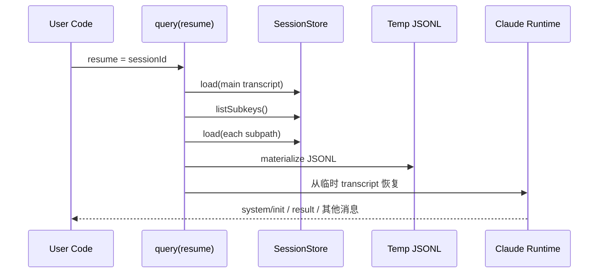

# 08 消息流、结果流与会话恢复

## 本章抓手

如果你把 Agent 当成一个黑盒，只盯最终 result，会失去很多关键信息。这个 SDK 的一个强点是：它把运行过程暴露成了一条消息流。

## SDKMessage 为什么重要

在 ../third_party/claude-agent-sdk-npm/package/sdk.d.ts 中，SDKMessage 是一个很大的联合类型。你不需要一口气记住所有成员，但要先抓住这几类：

- assistant 或 stream_event：模型正在说什么。
- system/init：会话启动了，session_id 出来了。
- system/status：当前阶段在做什么。
- result：这轮任务以什么方式收束。
- system/mirror_error：外部会话镜像失败了，但主流程可能还继续。
- task_progress / task_started / task_updated：多 Agent 场景下的任务进展。
- prompt_suggestion：系统预测你下一轮可能会问什么。

## 为什么消息流比“一次返回一个字符串”更强

因为它允许你做三件传统 API 很难做好的事情：

- 做实时 UI，而不是等最后一句话。
- 做过程级观测，而不是只看结果。
- 做失败定位，知道问题出在权限、工具、镜像还是模型。

## 推荐的消费方式

```ts
for await (const m of query({ prompt, options })) {
  if (m.type === 'system' && m.subtype === 'init') {
    console.log('session id =', m.session_id)
  }

  if (m.type === 'stream_event') {
    // 处理流式片段
  }

  if (m.type === 'result') {
    console.log('final =', 'result' in m ? m.result : '')
  }
}
```

## includePartialMessages 与 includeHookEvents

默认情况下，你未必能看到所有过程细节。Options 中有两个很关键的开关：

- includePartialMessages：把流式片段显式发出来。
- includeHookEvents：把 hook_started、hook_progress、hook_response 这类事件发出来。

这两个开关特别适合做研究可观测性或 Agent UI 原型。

## resume 到底在恢复什么

resume 不是简单“带上历史聊天记录”，而是恢复一段完整 session 的运行上下文。对于接了 SessionStore 的场景，恢复路径大致是：

1. 用 sessionId 找到主 transcript。
2. 如果实现了 listSubkeys，再把子 Agent transcript 一并找出来。
3. 把这些内容 materialize 成临时 JSONL。
4. 再让 Claude Code 的既有恢复逻辑从这个临时文件继续。

这就是为什么 SessionStore 的 load 和 listSubkeys 语义必须清晰。

## 一张恢复时序图



## mirror_error 为什么值得单独注意

SessionStore 的 append 是镜像，不是主写路径。SDK 文档明确说：如果 append 失败，会记录并发出 mirror_error，但主会话不会因此被阻断。这背后是一个很务实的工程选择：

- 主任务优先完成。
- 外部镜像失败需要被看见，但不应拖死主流程。

对于实验系统，这一点很重要，因为你不能把“额外观测模块”变成“主任务单点故障”。

## 本章小结

把 query 的输出理解成消息流，而不是简单结果值，你才真正进入了 Agent 系统的工程视角。resume、hook 观测、多 Agent 进度、镜像错误，全都依赖这条流来暴露。