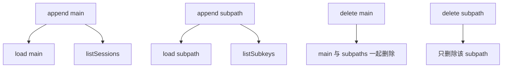

# 09 SessionStore 契约：这套仓库最像教材的部分

## 本章抓手

如果让我从这个仓库里选一个最适合研究生做代码精读和软件工程分析的主题，我会选 SessionStore。原因很简单：接口小、边界清、行为可测、实现可比。

## SessionStore 是干什么的

它负责把本地 session transcript 镜像到外部存储，并在需要时把完整会话重新装配回来。对应定义在 ../third_party/claude-agent-sdk-npm/package/sdk.d.ts。

最核心的接口有五个：

- append(key, entries)
- load(key)
- listSessions(projectKey)
- delete(key)
- listSubkeys(key)

其中只有 append 和 load 是必需项，其余是可选项。

## 先看真实契约

这一章很适合直接贴接口，因为接口本身就已经说明了设计重点。Python 版本仍然是教学等价写法，目的是把契约结构讲清楚。

<style>
.code-tabs {
  margin: 16px 0;
  border: 1px solid #d0d7de;
  border-radius: 8px;
  overflow: hidden;
}

.code-tabs input {
  display: none;
}

.code-tabs .tab-labels {
  display: flex;
  background: #f6f8fa;
  border-bottom: 1px solid #d0d7de;
}

.code-tabs .tab-labels label {
  padding: 8px 14px;
  cursor: pointer;
  font-size: 14px;
  border-right: 1px solid #d0d7de;
}

.code-tabs .tab-panel {
  display: none;
  padding: 0;
}

.code-tabs pre {
  margin: 0;
  padding: 16px;
  overflow-x: auto;
}

#sessionstore-tab-ts:checked ~ .tab-labels label[for="sessionstore-tab-ts"],
#sessionstore-tab-py:checked ~ .tab-labels label[for="sessionstore-tab-py"] {
  background: white;
  font-weight: 600;
}

#sessionstore-tab-ts:checked ~ .tab-content .ts,
#sessionstore-tab-py:checked ~ .tab-content .py {
  display: block;
}
</style>
<div class="code-tabs">
<input type="radio" name="sessionstore-code-tab" id="sessionstore-tab-ts" checked>
<input type="radio" name="sessionstore-code-tab" id="sessionstore-tab-py">
<div class="tab-labels">
<label for="sessionstore-tab-ts">TypeScript</label>
<label for="sessionstore-tab-py">Python</label>
</div>
<div class="tab-content">
<div class="tab-panel ts">

```ts
export declare type SessionStore = {
    append(key: SessionKey, entries: SessionStoreEntry[]): Promise<void>;
    load(key: SessionKey): Promise<SessionStoreEntry[] | null>;
    listSessions?(projectKey: string): Promise<Array<{
        sessionId: string;
        mtime: number;
    }>>;
    delete?(key: SessionKey): Promise<void>;
    listSubkeys?(key: {
        projectKey: string;
        sessionId: string;
    }): Promise<string[]>;
};
```

</div>
<div class="tab-panel py">

```py
class SessionStore(Protocol):
    async def append(
        self,
        key: SessionKey,
        entries: list[SessionStoreEntry],
    ) -> None: ...

    async def load(
        self,
        key: SessionKey,
    ) -> list[SessionStoreEntry] | None: ...

    async def listSessions(
        self,
        projectKey: str,
    ) -> list[dict[str, int]]: ...

    async def delete(self, key: SessionKey) -> None: ...

    async def listSubkeys(
        self,
        key: dict[str, str],
    ) -> list[str]: ...
```

</div>
</div>
</div>

> 这段接口最值得注意的地方，不是方法多，而是主次非常清楚：`append` 和 `load` 是最小闭环，剩下三个方法是在恢复、列举和清理阶段把系统补完整。

- `append` 负责写入新增条目。
- `load` 负责把一条会话完整取回来。
- `listSessions`、`delete`、`listSubkeys` 让系统具备发现、删除、恢复分支这些能力。

你可以把 SessionStore 想成“会话外存总线”。主线只有两步：写进去、取出来。其他方法像围绕总线长出来的管理能力。

## 先理解设计哲学

### 哲学 1：主写在本地，外部存储是镜像

append 是在本地写成功之后触发的 secondary copy。SessionStore 负责外部同步与恢复支持，本地 transcript 仍是主写路径。

### 哲学 2：接口保证行为，不强求具体存储形式

你可以用 Redis list、Postgres row、S3 part files 来实现。SDK 通过行为契约来约束这些实现，重点包括：

- 顺序是否正确。
- 主 transcript 与 subpath 是否隔离。
- 未知 key 是否返回 null。
- 删除是否按契约级联或精确删除。

### 哲学 3：深相等比字节相等更重要

文档明确说明，返回内容只需与 append 进去的数据 deep-equal。像 Postgres JSONB 这样的后端可以重排 object key，只要结构和内容保持一致即可。

## SessionKey 与 subpath

key 里除了 projectKey 和 sessionId，还可能有 subpath。你可以把 subpath 理解成“主 session 下面的分支轨迹”，典型场景是子 Agent transcript。

这意味着一个合格的存储实现必须处理两类空间：

- main transcript
- subpath transcript

而且它们不能互相污染。

## 13 项一致性测试在测什么

../examples/session-stores/shared/conformance.ts 定义了一套 13-contract suite。这套测试专注语义正确性；性能、吞吐和弹性需要单独压测。

| 测试主题 | 实际在保护什么 |
| --- | --- |
| append 后 load 顺序一致 | 基本可恢复性 |
| 未知 key 返回 null | 区分“没写过”和“空结果” |
| 多次 append 保持调用顺序 | 增量写入的正确性 |
| append([]) 是 no-op | 防止空批次污染状态 |
| subpath 与 main 隔离 | 子 Agent 不串台 |
| projectKey 隔离 | 项目维度不串台 |
| listSessions 行为 | 项目下会话发现 |
| listSessions 排除 subpath | 不把子路径伪装成 session |
| delete main | 删除主会话 |
| delete main 级联 subkeys | 清理完整 session |
| delete subpath 精确删除 | 不误删兄弟路径 |
| listSubkeys 返回当前会话子路径 | resume 可发现分支 |
| listSubkeys 不包含 main transcript | 主路径与子路径边界清楚 |

## 一张契约图



## 为什么这部分特别适合教学

- 接口尺寸小，读起来不累。
- 契约明确，容易设计单元测试。
- 三个后端实现差异很大，天然适合做比较分析。
- 它同时涉及软件工程、系统设计、实验评测。

## 给学生的一个好练习

自己写一个文件系统版 SessionStore，然后直接复用 ../examples/session-stores/shared/conformance.ts 来跑。这比空写一篇“我理解了接口”有价值得多。

## 本章小结

SessionStore 展示了一种很成熟的工程抽象：先定义最小契约，再用一致性测试锁住行为，最后允许多种后端自由实现。这个模式在很多系统研究中都非常值得借鉴。
