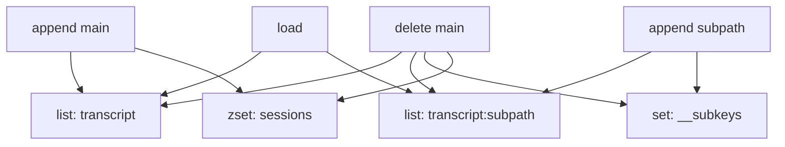

# 10 RedisSessionStore 精读：最适合入门的参考实现

## 本章抓手

三个后端里，Redis 版本最适合先读。原因是它既足够真实，又足够直观：list、set、zset 三种结构就把核心契约撑起来了。

源码在 ../examples/session-stores/redis/src/RedisSessionStore.ts。

## 先看键设计

Redis 版本用了四类 key：

```text
{prefix}:{projectKey}:{sessionId}             list
{prefix}:{projectKey}:{sessionId}:{subpath}   list
{prefix}:{projectKey}:{sessionId}:__subkeys   set
{prefix}:{projectKey}:__sessions              zset
```

这四类 key 对应四件事：

- main transcript 怎么存。
- subpath transcript 怎么存。
- 当前 session 下有哪些 subpath。
- 当前 project 下有哪些 session 以及它们的 mtime。

## append 的设计很漂亮

append(key, entries) 做了两类动作：

- 把 entries JSON 化后 RPUSH 到 transcript list。
- 如果是 subpath，就把 subpath 写入 __subkeys。
- 如果是 main transcript，就更新 __sessions 的 zset 时间戳。

而且这些操作通过 MULTI 一起提交。这说明作者很清楚：

- transcript 本体和索引要尽量同步。
- 但索引更新策略要区分 main 与 subpath。

为什么 subpath 不进 sessions index？因为 listSessions 只应该返回真正的主会话，不应该把子路径伪装成 session。

## load 为什么很朴素

load 就是 LRANGE 0 -1，然后逐行 JSON.parse。简单，但完全够用。它还专门容忍 malformed entry，直接跳过，和 S3 实现保持了语义一致。

这告诉我们一个工程判断：

- SessionStore 的主要目标是恢复与镜像，不是事务级审计系统。
- 对轻微坏数据做容错，比因为一行坏数据让整个会话不可恢复更务实。

## delete 的两种语义

### 删除 main key

会级联删除：主 transcript、所有 subpath transcript、subkeys 集合、sessions 索引项。

### 删除 subpath key

只删这个 subpath 对应的 list，并从 __subkeys 中移除该项。

这正好和 conformance suite 的要求一一对应。

## 结构图



## 为什么说它最适合教学

- 数据结构直观。
- 每个方法都不长。
- 几乎每段代码都能和契约测试直接对应。
- 它天然带出索引维护、幂等、容错、级联删除这些软件工程话题。

## 研究视角还能看什么

- 是否要加 TTL。
- eviction 对 session 可靠性的影响。
- Cluster 模式下 key hash tag 怎么设计。
- mirror 延迟与读恢复延迟之间的权衡。

## 本章小结

Redis 实现像一把手术刀：短、小、准。它把 SessionStore 的抽象翻译成了非常清晰的数据结构操作，是最适合做课堂精读的代码样本。