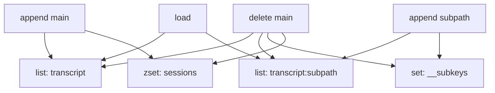

# 10 RedisSessionStore 精读：最适合入门的参考实现

## 本章抓手

三个后端里，Redis 版本最适合先读。原因是它既足够真实，又足够直观：list、set、zset 三种结构就把核心契约撑起来了。

源码在 ../examples/session-stores/redis/src/RedisSessionStore.ts。

## 先看键设计

Redis 版本用了四类 key：

```text
{prefix}:{projectKey}:{sessionId}             list
{prefix}:{projectKey}:{sessionId}:{subpath}   list
{prefix}:{projectKey}:{sessionId}:__subkeys   set
{prefix}:{projectKey}:__sessions              zset
```

这四类 key 对应四件事：

- main transcript 怎么存。
- subpath transcript 怎么存。
- 当前 session 下有哪些 subpath。
- 当前 project 下有哪些 session 以及它们的 mtime。

## 把真实代码放到眼前

下面这段代码是 Redis 版本里最值得精读的核心。它没有很多抽象层，正适合教学。Python 版本是教学等价写法，用来帮你把数据结构操作看懂。

<style>
.code-tabs {
  margin: 16px 0;
  border: 1px solid #d0d7de;
  border-radius: 8px;
  overflow: hidden;
}

.code-tabs input {
  display: none;
}

.code-tabs .tab-labels {
  display: flex;
  background: #f6f8fa;
  border-bottom: 1px solid #d0d7de;
}

.code-tabs .tab-labels label {
  padding: 8px 14px;
  cursor: pointer;
  font-size: 14px;
  border-right: 1px solid #d0d7de;
}

.code-tabs .tab-panel {
  display: none;
  padding: 0;
}

.code-tabs pre {
  margin: 0;
  padding: 16px;
  overflow-x: auto;
}

#redisstore-tab-ts:checked ~ .tab-labels label[for="redisstore-tab-ts"],
#redisstore-tab-py:checked ~ .tab-labels label[for="redisstore-tab-py"] {
  background: white;
  font-weight: 600;
}

#redisstore-tab-ts:checked ~ .tab-content .ts,
#redisstore-tab-py:checked ~ .tab-content .py {
  display: block;
}
</style>
<div class="code-tabs">
<input type="radio" name="redisstore-code-tab" id="redisstore-tab-ts" checked>
<input type="radio" name="redisstore-code-tab" id="redisstore-tab-py">
<div class="tab-labels">
<label for="redisstore-tab-ts">TypeScript</label>
<label for="redisstore-tab-py">Python</label>
</div>
<div class="tab-content">
<div class="tab-panel ts">

```ts
async append(key: SessionKey, entries: SessionStoreEntry[]): Promise<void> {
  if (entries.length === 0) return
  const pipe = this.client.multi()
  pipe.rpush(this.entryKey(key), ...entries.map(e => JSON.stringify(e)))
  if (key.subpath) {
    pipe.sadd(this.subkeysKey(key), key.subpath)
  } else {
    pipe.zadd(this.sessionsKey(key.projectKey), Date.now(), key.sessionId)
  }
  await pipe.exec()
}

async load(key: SessionKey): Promise<SessionStoreEntry[] | null> {
  const raw = await this.client.lrange(this.entryKey(key), 0, -1)
  if (raw.length === 0) return null
  const out: SessionStoreEntry[] = []
  for (const line of raw) {
    try {
      out.push(JSON.parse(line))
    } catch {}
  }
  return out.length > 0 ? out : null
}
```

</div>
<div class="tab-panel py">

```py
async def append(self, key, entries):
    if not entries:
        return
    pipe = self.client.multi()
    pipe.rpush(self.entry_key(key), *[json.dumps(e) for e in entries])
    if key.subpath:
        pipe.sadd(self.subkeys_key(key), key.subpath)
    else:
        pipe.zadd(self.sessions_key(key.projectKey), time.time() * 1000, key.sessionId)
    await pipe.exec()

async def load(self, key):
    raw = await self.client.lrange(self.entry_key(key), 0, -1)
    if not raw:
        return None
    out = []
    for line in raw:
        try:
            out.append(json.loads(line))
        except Exception:
            pass
    return out or None
```

</div>
</div>
</div>

> `append` 负责写进去，`load` 负责按顺序读回来。Redis 版本之所以好读，就是因为这两步几乎直接把契约翻译成了数据结构操作。

- `RPUSH` 说明 transcript 本体是按顺序追加的。
- `SADD` 说明 subpath 需要单独登记。
- `ZADD` 说明主会话还要维护一个按时间排序的索引。
- `LRANGE + JSON.parse` 说明恢复时就是把这串条目按原顺序重新装起来。

你可以把这段实现想成两套账本同时维护：一套是正文账本，也就是 transcript list；另一套是检索索引，也就是 `__subkeys` 和 `__sessions`。正文负责恢复，索引负责找得到。

## append 的设计很漂亮

append(key, entries) 做了两类动作：

- 把 entries JSON 化后 RPUSH 到 transcript list。
- 如果是 subpath，就把 subpath 写入 __subkeys。
- 如果是 main transcript，就更新 __sessions 的 zset 时间戳。

而且这些操作通过 MULTI 一起提交。这说明作者很清楚：

- transcript 本体和索引要尽量同步。
- 但索引更新策略要区分 main 与 subpath。

为什么 subpath 不进 sessions index？因为 listSessions 只应该返回真正的主会话，不应该把子路径伪装成 session。

## load 为什么很朴素

load 就是 LRANGE 0 -1，然后逐行 JSON.parse。简单，但完全够用。它还专门容忍 malformed entry，直接跳过，和 S3 实现保持了语义一致。

这告诉我们一个工程判断：

- SessionStore 的主要目标是恢复与镜像；如果需要事务级审计，还要额外设计对应能力。
- 对轻微坏数据做容错，比因为一行坏数据让整个会话不可恢复更务实。

## delete 的两种语义

### 删除 main key

会级联删除：主 transcript、所有 subpath transcript、subkeys 集合、sessions 索引项。

### 删除 subpath key

只删这个 subpath 对应的 list，并从 __subkeys 中移除该项。

这正好和 conformance suite 的要求一一对应。

## 结构图



## 为什么说它最适合教学

- 数据结构直观。
- 每个方法都不长。
- 几乎每段代码都能和契约测试直接对应。
- 它天然带出索引维护、幂等、容错、级联删除这些软件工程话题。

## 研究视角还能看什么

- 是否要加 TTL。
- eviction 对 session 可靠性的影响。
- Cluster 模式下 key hash tag 怎么设计。
- mirror 延迟与读恢复延迟之间的权衡。

## 本章小结

Redis 实现像一把手术刀：短、小、准。它把 SessionStore 的抽象翻译成了非常清晰的数据结构操作，是最适合做课堂精读的代码样本。
