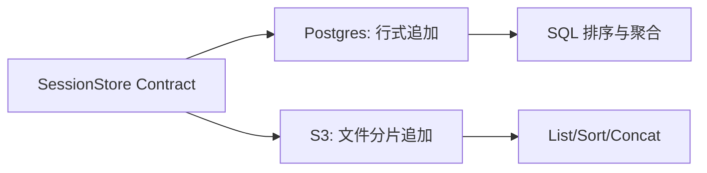

# 11 Postgres 与 S3 对照：同一契约，完全不同的存储思路

## 本章抓手

Redis 让你看到“怎么做”。Postgres 和 S3 更进一步，让你看到“同一契约可以怎样完全不同地实现”。这对系统设计训练非常有帮助。

## 一张总对比表

| 维度 | Postgres | S3 |
| --- | --- | --- |
| 核心单位 | 一行 entry | 一个 JSONL part file |
| 写入方式 | INSERT 多行 | PutObject 新 part |
| 顺序依据 | BIGSERIAL id | part 文件名中的 13 位 epoch ms |
| listSessions | 聚合 MAX(created_at) | 扫描对象键并提取 mtime |
| delete main | SQL 删除整会话 | 删除前缀下对象 |
| delete subpath | 精确删某个 subpath | 只删除该前缀下的直子对象，避免把更深层路径一起误删 |
| 典型风险 | 连接池、表膨胀 | 时钟偏斜、对象分页、线性扫描 |

## Postgres：关系数据库视角

源码在 ../examples/session-stores/postgres/src/PostgresSessionStore.ts。

它的核心设计是“一条 transcript entry 对应一行表记录”。好处是：

- 顺序问题交给 BIGSERIAL。
- 条件过滤交给 SQL。
- subpath、projectKey、sessionId 都能自然建索引。

尤其值得注意的是这个判断：

- main transcript 用 subpath IS NOT DISTINCT FROM NULL 来查。

这个写法用来精确表达“主 transcript 的 subpath 语义就是空值”。

## S3：对象存储视角

源码在 ../examples/session-stores/s3/src/S3SessionStore.ts。

S3 版本的核心思路是：每次 append 都生成一个新的 JSONL part 文件，文件名里带时间戳和随机后缀，例如：

```text
part-0000000123456-ab12cd.jsonl
```

这样做的好处是：

- append 简单，不需要改旧对象。
- 天然适合对象存储的写法。

但代价也很明显：

- load 要先 list，再 sort，再批量 get，再拼接。
- listSessions 不能靠数据库聚合，只能从 key 路径和 part name 里推导。
- 多实例时如果时钟漂移太大，顺序就可能出现问题。

## 为什么 S3 代码里反复强调 Delimiter

这是一个很好的工程细节。主 transcript 的 load 不能把 subpath 下的对象误扫进来，否则恢复结果会被污染。所以代码里专门用 Delimiter 和路径判断来保护“只拿当前前缀的直子 part file”。

这类细节正说明：

- 接口简单，不代表实现简单。
- 对象存储尤其容易在“路径看起来像目录、底层实际是一组对象键”这件事上出错。

## 两种实现背后的系统思维



## 课堂上最值得提问的比较点

- 如果你追求低延迟恢复，哪种后端更友好。
- 如果你追求便宜的大规模归档，哪种后端更自然。
- 如果你需要强查询能力，哪种后端更合适。
- 如果你需要最少维护成本，哪种后端更稳。

## 本章小结

Postgres 和 S3 让你看到一个很重要的工程事实：真正稳定的抽象允许实现各不相同，同时继续满足同一行为契约。