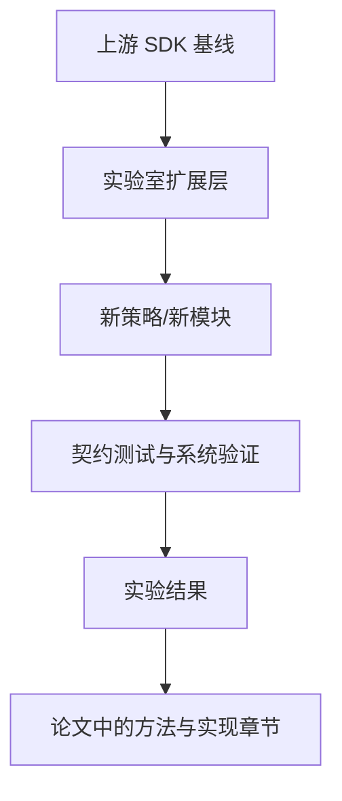

# 13 从教材到论文：如何在这个仓库上继续做研究扩展

## 本章抓手

对研究生来说，更关键的问题通常是“能不能在这套基线上继续做出自己的东西”。答案是可以，而且这仓库很适合作为起点。

## 为什么它适合做研究基线

- 上游来源清楚，版本可追踪，见 ../INPLUSLAB_BOOTSTRAP.md。
- 变更脉络清楚，见 ../CHANGELOG.md。
- 公开接口面明确，见 ../third_party/claude-agent-sdk-npm/package/sdk.d.ts。
- 会话持久化有完整的参考实现和契约测试，见 ../examples/session-stores。

这四点合在一起，意味着你可以比较容易地回答论文里常见的几个问题：

- baseline 是什么。
- 你改了什么。
- 改动边界在哪里。
- 怎么验证新设计没有破坏旧语义。

## 最推荐的扩展位置

../INPLUSLAB_BOOTSTRAP.md 已经给了很好的建议：在单独目录里建立自己的 extension layer，例如 packages、src 或 experiments。这样上游快照、实验层和扩展层的边界会更清楚。

## 四条很自然的研究路线

### 路线 1：权限与风险控制

落点：PermissionMode、canUseTool、hooks。

可做的问题：

- 风险感知审批。
- 自动白名单学习。
- 不同安全策略下的任务完成率与误操作率。

### 路线 2：多 Agent 协作

落点：AgentDefinition、task_progress、background agent。

可做的问题：

- 任务分解质量。
- 协作开销与收益。
- 子 Agent 失败后的恢复策略。

### 路线 3：长程记忆与会话管理

落点：SessionStore、resume、subpath、listSubkeys。

可做的问题：

- transcript 压缩与摘要。
- 多后端混合记忆。
- 恢复延迟与历史长度之间的关系。

### 路线 4：工具增强与外部知识

落点：MCP、plugins、hooks。

可做的问题：

- 领域工具接入。
- Agent 调用检索或分析系统的策略优化。
- 结构化 outputFormat 对评测的帮助。

## 一张研究落地图

## 写论文时最容易忽略的两件事

### 1. 行为保真

如果你修改了 SessionStore、权限流或消息流，请先证明没有破坏原契约。否则论文里“方法有效”的结论会被基础实现问题污染。

### 2. 评测目标要和接口层对齐

你研究的是安全，就别只报 BLEU 一类生成指标。你研究的是恢复机制，就要测 resume 成功率、恢复时延、历史规模下的成本曲线。

## 给实验室开发的一个稳妥建议

把仓库分成三层维护：

- upstream snapshot：尽量少碰。
- lab extension：你们真正的新增模块。
- experiments：临时验证、数据脚本、ablation。

这样代码、实验、论文三者的边界会清楚很多。

## 本章小结

这仓库最有价值的地方，不只是它能跑通一个 Agent，而是它提供了一块边界清晰、可验证、可追溯的研究底板。对研究生来说，这比一堆大而混乱的业务代码更珍贵。