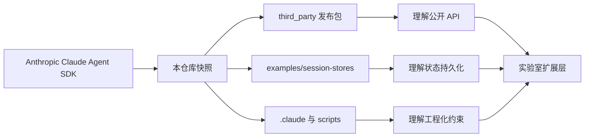

# Agent-Framework Tutorial Docs

这套文档把本仓库当作一门小型教材来讲。目标不是教你“会用几个命令”，而是帮你建立一张稳定的脑图：什么是 LLM Agent，Claude Agent SDK 到底暴露了什么抽象，这个仓库为什么几乎没有业务代码却依然很值得学，以及你怎样在这个基线上继续做实验、做系统、做论文。

## 先给仓库下一个定义

这个仓库本质上由三层材料构成：

- 上游 SDK 的仓库快照，见 ../README.md 和 ../INPLUSLAB_BOOTSTRAP.md。
- 已发布 npm 包的实际类型与构件，见 ../third_party/claude-agent-sdk-npm/package。
- 三个 SessionStore 参考实现与一致性测试，见 ../examples/session-stores。

可以把它想成一张“实验室基线底板”：官方能力已经在这里，适合继续向上长自己的扩展层。

## 建议阅读顺序

| 章节 | 你会得到什么 |
| --- | --- |
| [01-orientation.md](01-orientation.md) | 知道这套教程怎么读，什么该先懂，什么可以后看 |
| [02-repo-map.md](02-repo-map.md) | 看清仓库分层，不再被“为什么没有 src”困住 |
| [03-core-concepts.md](03-core-concepts.md) | 把 LLM、Agent、Tool、Session、MCP 放在一张图里 |
| [04-first-query.md](04-first-query.md) | 从 query() 入口读懂一次最小 Agent 调用 |
| [05-options.md](05-options.md) | 把 Options 当成控制台，理解运行边界与行为开关 |
| [06-permissions-and-sandbox.md](06-permissions-and-sandbox.md) | 理解权限、沙箱、人类在环控制 |
| [07-agents-hooks-mcp.md](07-agents-hooks-mcp.md) | 理解子 Agent、Hooks、MCP 这三块扩展面 |
| [08-message-stream-and-resume.md](08-message-stream-and-resume.md) | 读懂消息流、结果流与恢复机制 |
| [09-session-store-contract.md](09-session-store-contract.md) | 理解 SessionStore 契约与 13 项一致性测试 |
| [10-redis-session-store.md](10-redis-session-store.md) | 精读 Redis 适配器实现 |
| [11-postgres-and-s3.md](11-postgres-and-s3.md) | 对比 Postgres 与 S3 的持久化设计 |
| [12-experiments-and-pitfalls.md](12-experiments-and-pitfalls.md) | 学会跑示例、复现实验、规避常见坑 |
| [13-research-extension-roadmap.md](13-research-extension-roadmap.md) | 把仓库转成论文和系统工作的出发点 |
| [14-glossary.md](14-glossary.md) | 快速查术语，避免概念混淆 |

## 三条学习路径

### 路径 A：3 小时速读

按 02 -> 03 -> 04 -> 09 -> 10 的顺序读。目标是先搭起“入口 + 状态 + 示例”三件套。

### 路径 B：1 天工程入门

按 02 -> 03 -> 04 -> 05 -> 06 -> 07 -> 08 -> 09 -> 10 -> 11 -> 12 的顺序读。目标是能自己改造一个 Agent 应用。

### 路径 C：1 周研究准备

完整读完全部章节，再重点回看 06、07、09、13。目标是从权限控制、多 Agent、长程记忆、实验评测中挑出自己的题目。

## 阅读前准备

- 你需要懂基础软件工程：接口、抽象、测试、持久化、配置。
- 你最好懂一点论文写作：问题定义、baseline、实验设计、威胁与局限。
- 你不需要提前精通 LLM Agent。本教程会先把最容易混淆的概念压平。

## 仓库内最关键的源码锚点

- query 入口：../third_party/claude-agent-sdk-npm/package/sdk.d.ts
- 会话持久化契约：../third_party/claude-agent-sdk-npm/package/sdk.d.ts
- Redis 参考实现：../examples/session-stores/redis/src/RedisSessionStore.ts
- Postgres 参考实现：../examples/session-stores/postgres/src/PostgresSessionStore.ts
- S3 参考实现：../examples/session-stores/s3/src/S3SessionStore.ts
- 一致性测试：../examples/session-stores/shared/conformance.ts
- 仓库基线说明：../INPLUSLAB_BOOTSTRAP.md

## 怎样把这套文档当成课程

- 每章先看“本章抓手”，知道自己要解决什么问题。
- 再看“源码锚点”，把抽象和具体文件绑定起来。
- 最后做“思考题或实验建议”，把阅读变成动手。

如果你是导师，可以把 04、09、10、11 作为一节“代码精读课”；把 06、07、13 作为一节“研究选题课”。